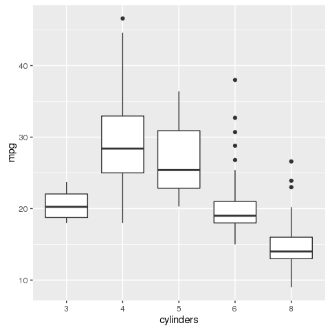

# Lab: Modified Introduction To R
  
`r format(Sys.time(), "%b %d, %Y")`  


## Basic Commands

`R` uses functions to perform operations. To run a function called `funcname`, we type `funcname(input1, input2)`, where the inputs (or arguments) `input1` argument and `input2` tell `R` how to run the function. A function can have any number of inputs. For example, to create a vector of numbers, we use the function `c()` (for concatenate). Any numbers inside the parentheses are joined together. The following command instructs `R` to join together the numbers 1,3,2,1,3,2, and 55, and to save them as a vector named `x`. When we type `x`, it gives us back the vector.


```r
x <- c(1, 3, 2, 5) 
x
```

```
[1] 1 3 2 5
```

Note that the `>` is not part of the command; rather, it is printed by `R` to indicate that it is ready for another command to be entered. We can also save things using `=` rather than `<-`:


```r
x = c(1, 6, 2)
x
```

```
[1] 1 6 2
```


```r
y = c(1, 4, 3)
y
```

```
[1] 1 4 3
```

Hitting the up arrow multiple times will display the previous commands, which can then be edited. This is useful since one often wishes to repeat a similar command. In addition, typing `?funcname` will always cause `R` to open a new help file window with additional information about the function `funcname`.

We can tell `R` to add two sets of numbers together. It will then add the first number from `x` to the first number from `y`, and so on. However, `x` and `y` should be the same length. We can check their length using the `length()` function.


```r
length(x)
```

```
[1] 3
```


```r
length(y)
```

```
[1] 3
```


```r
x + y
```

```
[1]  2 10  5
```

The `ls()` function allows us to look at a list of all of the objects, such as data and functions, that we have saved so far. The `rm()` function can be used to delete any that we don’t want.


```r
ls()
```

```
[1] "x" "y"
```


```r
rm(x, y)
ls()
```

```
character(0)
```

It’s also possible to remove all objects at once:


```r
rm(list = ls())
```

The `matrix()` function can be used to create a matrix of numbers. Before we use the `matrix()` function, we can learn more about it:


```r
?matrix
```

The help file reveals that the `matrix()` function takes a number of inputs, but for now we focus on the first three: the data (the entries in the matrix), the number of rows, and the number of columns. First, we create a simple matrix.


```r
x <- matrix(data = c(1, 2, 3, 4), nrow = 2, ncol = 2)
x
```

```
     [,1] [,2]
[1,]    1    3
[2,]    2    4
```

Note that we could just as well omit typing `data =`, `nrow =`, and `ncol =` in the `matrix()` command above: that is, we could just type


```r
x <- matrix(c(1, 2, 3, 4), 2, 2)
```

and this would have the same effect. However, it can sometimes be useful to specify the names of the arguments passed in, since otherwise `R` will assume that the function arguments are passed into the function in the same order that is given in the function’s help file. As this example illustrates, by default `R` creates matrices by successively filling in columns. Alternatively, the `byrow = TRUE` option can be used to populate the matrix in order of the rows.


```r
matrix(c(1, 2, 3, 4), 2, 2, byrow = TRUE)
```

```
     [,1] [,2]
[1,]    1    2
[2,]    3    4
```

Notice that in the above command we did not assign the matrix to a value such as `x`. In this case the matrix is printed to the screen but is not saved for future calculations. The `sqrt()` function returns the square root of each element of a vector or matrix. The command `x^2` raises each element of `x` to the power `2`; any powers are possible, including fractional or negative powers.


```r
sqrt(x)
```

```
         [,1]     [,2]
[1,] 1.000000 1.732051
[2,] 1.414214 2.000000
```


```r
x^2
```

```
     [,1] [,2]
[1,]    1    9
[2,]    4   16
```

The `rnorm()` function generates a vector of random normal variables, with first argument `n` the sample size. Each time we call this function, we will get a different answer. Here we create two correlated sets of numbers, `x` and `y`, and use the `cor()` function to compute the correlation between them.


```r
x = rnorm(50)
y = x + rnorm(50, mean = 50, sd = 0.1)
cor(x, y)
```

```
[1] 0.9949373
```

By default, `rnorm()` creates standard normal random variables with a mean of `0` and a standard deviation of `1`. However, the mean and standard deviation can be altered using the mean and sd arguments, as illustrated above. Sometimes we want our code to reproduce the exact same set of random numbers; we can use the `set.seed()` function to do this. The `set.seed()` function takes an (arbitrary) integer argument.


```r
set.seed(1303)
rnorm(50)
```

```
 [1] -1.1439763145  1.3421293656  2.1853904757  0.5363925179  0.0631929665
 [6]  0.5022344825 -0.0004167247  0.5658198405 -0.5725226890 -1.1102250073
[11] -0.0486871234 -0.6956562176  0.8289174803  0.2066528551 -0.2356745091
[16] -0.5563104914 -0.3647543571  0.8623550343 -0.6307715354  0.3136021252
[21] -0.9314953177  0.8238676185  0.5233707021  0.7069214120  0.4202043256
[26] -0.2690521547 -1.5103172999 -0.6902124766 -0.1434719524 -1.0135274099
[31]  1.5732737361  0.0127465055  0.8726470499  0.4220661905 -0.0188157917
[36]  2.6157489689 -0.6931401748 -0.2663217810 -0.7206364412  1.3677342065
[41]  0.2640073322  0.6321868074 -1.3306509858  0.0268888182  1.0406363208
[46]  1.3120237985 -0.0300020767 -0.2500257125  0.0234144857  1.6598706557
```

We use `set.seed()` throughout the labs whenever we perform calculations involving random quantities. In general this should allow the user to reproduce our results. However, it should be noted that as new versions of `R` become available it is possible that some small discrepancies may form between the book and the output from `R`.

The `mean()` and `var()` functions can be used to compute the mean and variance of a vector of numbers. Applying `sqrt()` to the output of `var()` will give the standard deviation. Or we can simply use the `sd()` function.


```r
set.seed(3)
y <- rnorm(100)
mean(y)
```

```
[1] 0.01103557
```


```r
var(y)
```

```
[1] 0.7328675
```


```r
sqrt(var(y))
```

```
[1] 0.8560768
```


```r
sd(y)
```

```
[1] 0.8560768
```

## Graphics

The `plot()` function is the primary way to plot data in `R`. For instance, `plot(x, y)` produces a scatterplot of the numbers in `x` versus the numbers in `y`. There are many additional options that can be passed in to the `plot()` function. For example, passing in the argument `xlab` will result in a label on the x-axis. To find out more information about the `plot()` function, type `?plot.`


```r
x <- rnorm(100)
y <- rnorm(100)
plot(x, y)
```


```r
plot(x, y, xlab = "this is the x-axis", ylab = "this is the y-axis", 
     main = "Plot of X vs Y")
```


We will often want to save the output of an `R` plot. The command that we use to do this will depend on the file type that we would like to create. For instance, to create a jpeg, we use the `jpeg()` function, and to create a pdf, we use the `pdf()` function.


```r
jpeg(file= "./JPG/YourFileName.jpeg")
plot(x, y, col = "green")
dev.off()
```

```
png 
  2 
```


The function `dev.off()` indicates to `R` that we are done creating the plot. Alternatively, we can simply copy the plot window and paste it into an appropriate file type, such as a Word document.

The function `seq()` can be used to create a sequence of numbers. For instance, `seq(a, b)` makes a vector of integers between `a` and `b`. There are many other options: for instance, `seq(0, 1, length = 10)` makes a sequence of 10 numbers that are equally spaced between 0 and 1. Typing 3:11 is a shorthand for `seq(3, 11)` for integer arguments.


```r
x <- seq(1, 10)
x
```

```
 [1]  1  2  3  4  5  6  7  8  9 10
```


```r
x <- 1:10
x
```

```
 [1]  1  2  3  4  5  6  7  8  9 10
```


```r
x = seq(-pi, pi, length = 50)
```

We will now create some more sophisticated plots. The `contour()` function produces a contour plot in order to represent three-dimensional data; it is like a topographical map. It takes three arguments:

A vector of the `x` values (the first dimension),
A vector of the `y` values (the second dimension), and
A matrix whose elements correspond to the `z` value (the third dimension) for each pair of `(x,y)` coordinates.
As with the `plot()` function, there are many other inputs that can be used to fine-tune the output of the `contour()` function. To learn more about these, take a look at the help file by typing `?contour`.


```r
y <- x
f <- outer(x, y, function(x, y){
  cos(y) / (1 + x^2)
})
contour(x, y, f)
contour(x, y, f, nlevels = 45, add = TRUE)
```


```r
fa <- (f -t(f))/2
contour(x, y, fa, nlevels = 15)
```


The `image()` function works the same way as `contour()`, except that it produces a color-coded plot whose colors depend on the `z` value. This is known as a heatmap, and is sometimes used to plot temperature in weather forecasts. Alternatively, `persp()` can be used to produce a three-dimensional plot. The arguments theta and phi control the angles at which the plot is `persp()` viewed.


```r
image(x, y, fa)
```


```r
persp(x, y, fa)
```


```r
persp(x, y, fa, theta = 30, phi = 20)
```


```r
persp(x, y, fa, theta = 30, phi = 70)
```


```r
persp(x, y, fa, theta = 30, phi = 40)
```


##Indexing

We often wish to examine part of a set of data. Suppose that our data is stored in the matrix `A`.


```r
A <- matrix(1:16, 4, 4)
A
```

```
     [,1] [,2] [,3] [,4]
[1,]    1    5    9   13
[2,]    2    6   10   14
[3,]    3    7   11   15
[4,]    4    8   12   16
```


```r
A[2, 3]
```

```
[1] 10
```

will select the element corresponding to the second row and the third column. The first number after the open-bracket symbol `[` always refers to the row, and the second number always refers to the column. We can also select multiple rows and columns at a time, by providing vectors as the indices.


```r
A[c(1, 3), c(2, 4)]
```

```
     [,1] [,2]
[1,]    5   13
[2,]    7   15
```


```r
A[1:3, 2:4]
```

```
     [,1] [,2] [,3]
[1,]    5    9   13
[2,]    6   10   14
[3,]    7   11   15
```


```r
A[1:2, ]
```

```
     [,1] [,2] [,3] [,4]
[1,]    1    5    9   13
[2,]    2    6   10   14
```


```r
A[, 1:2]
```

```
     [,1] [,2]
[1,]    1    5
[2,]    2    6
[3,]    3    7
[4,]    4    8
```

The last two examples include either no index for the columns or no index for the rows. These indicate that `R` should include all columns or all rows, respectively. `R` treats a single row or column of a matrix as a vector.


```r
A[1, ]
```

```
[1]  1  5  9 13
```

The use of a negative sign `-` in the index tells `R` to keep all rows or columns except those indicated in the index.


```r
A[-c(1, 3), ]
```

```
     [,1] [,2] [,3] [,4]
[1,]    2    6   10   14
[2,]    4    8   12   16
```

The `dim()` function outputs the number of rows followed by the number of columns of a given matrix.


```r
dim(A)
```

```
[1] 4 4
```

##Loading Data

For most analyses, the first step involves importing a data set into `R`. The `read.table()` function is one of the primary ways to do this. The help file contains details about how to use this function. We can use the function `write.table()` to export data. Before attempting to load a data set, we must make sure that `R` knows to search for the data in the proper directory. For example on a Windows system one could select the directory using the `Change dir. . .` option under the File menu. However, the details of how to do this depend on the operating system (e.g. Windows, Mac, Unix) that is being used, and so we do not give further details here. We begin by loading in the Auto data set. This data is part of the ISLR library (we discuss libraries in Chapter 3) but to illustrate the `read.table()` function we load it now from a text file. The following command will load the `Auto.data` file into `R` and store it as an object called `Auto`, in a format referred to as a data frame. (The text file can be obtained from this book’s website.)


```r
site <- "http://www-bcf.usc.edu/~gareth/ISL/Auto.data"
Auto <- read.table(file = site)
head(Auto)
```

```
    V1        V2           V3         V4     V5           V6   V7     V8
1  mpg cylinders displacement horsepower weight acceleration year origin
2 18.0         8        307.0      130.0  3504.         12.0   70      1
3 15.0         8        350.0      165.0  3693.         11.5   70      1
4 18.0         8        318.0      150.0  3436.         11.0   70      1
5 16.0         8        304.0      150.0  3433.         12.0   70      1
6 17.0         8        302.0      140.0  3449.         10.5   70      1
                         V9
1                      name
2 chevrolet chevelle malibu
3         buick skylark 320
4        plymouth satellite
5             amc rebel sst
6               ford torino
```

Note that `Auto.data` is simply a text file, which you could alternatively open on your computer using a standard text editor. It is often a good idea to view a data set using a text editor or other software such as Excel before loading it into `R`. This particular data set has not been loaded correctly, because `R` has assumed that the variable names are part of the data and so has included them in the first row. The data set also includes a number of missing observations, indicated by a question mark `?`. Missing values are a common occurrence in real data sets. Using the option header `= TRUE` in the `read.table()` function tells `R` that the first line of the file contains the variable names, and using the option `na.strings` tells `R` that any time it sees a particular character or set of characters (such as a question mark), it should be treated as a missing element of the data matrix.


```r
Auto <- read.table(file = site, header = TRUE, sep = "", na.strings = "?")
head(Auto)
```

```
  mpg cylinders displacement horsepower weight acceleration year origin
1  18         8          307        130   3504         12.0   70      1
2  15         8          350        165   3693         11.5   70      1
3  18         8          318        150   3436         11.0   70      1
4  16         8          304        150   3433         12.0   70      1
5  17         8          302        140   3449         10.5   70      1
6  15         8          429        198   4341         10.0   70      1
                       name
1 chevrolet chevelle malibu
2         buick skylark 320
3        plymouth satellite
4             amc rebel sst
5               ford torino
6          ford galaxie 500
```


```r
library(DT)
datatable(Auto)
```

<!--html_preserve--><div id="htmlwidget-1040" style="width:100%;height:auto;" class="datatables html-widget"></div>
<script type="application/json" data-for="htmlwidget-1040">{"x":{"filter":"none","data":[["1","2","3","4","5","6","7","8","9","10","11","12","13","14","15","16","17","18","19","20","21","22","23","24","25","26","27","28","29","30","31","32","33","34","35","36","37","38","39","40","41","42","43","44","45","46","47","48","49","50","51","52","53","54","55","56","57","58","59","60","61","62","63","64","65","66","67","68","69","70","71","72","73","74","75","76","77","78","79","80","81","82","83","84","85","86","87","88","89","90","91","92","93","94","95","96","97","98","99","100","101","102","103","104","105","106","107","108","109","110","111","112","113","114","115","116","117","118","119","120","121","122","123","124","125","126","127","128","129","130","131","132","133","134","135","136","137","138","139","140","141","142","143","144","145","146","147","148","149","150","151","152","153","154","155","156","157","158","159","160","161","162","163","164","165","166","167","168","169","170","171","172","173","174","175","176","177","178","179","180","181","182","183","184","185","186","187","188","189","190","191","192","193","194","195","196","197","198","199","200","201","202","203","204","205","206","207","208","209","210","211","212","213","214","215","216","217","218","219","220","221","222","223","224","225","226","227","228","229","230","231","232","233","234","235","236","237","238","239","240","241","242","243","244","245","246","247","248","249","250","251","252","253","254","255","256","257","258","259","260","261","262","263","264","265","266","267","268","269","270","271","272","273","274","275","276","277","278","279","280","281","282","283","284","285","286","287","288","289","290","291","292","293","294","295","296","297","298","299","300","301","302","303","304","305","306","307","308","309","310","311","312","313","314","315","316","317","318","319","320","321","322","323","324","325","326","327","328","329","330","331","332","333","334","335","336","337","338","339","340","341","342","343","344","345","346","347","348","349","350","351","352","353","354","355","356","357","358","359","360","361","362","363","364","365","366","367","368","369","370","371","372","373","374","375","376","377","378","379","380","381","382","383","384","385","386","387","388","389","390","391","392","393","394","395","396","397"],[18,15,18,16,17,15,14,14,14,15,15,14,15,14,24,22,18,21,27,26,25,24,25,26,21,10,10,11,9,27,28,25,25,19,16,17,19,18,14,14,14,14,12,13,13,18,22,19,18,23,28,30,30,31,35,27,26,24,25,23,20,21,13,14,15,14,17,11,13,12,13,19,15,13,13,14,18,22,21,26,22,28,23,28,27,13,14,13,14,15,12,13,13,14,13,12,13,18,16,18,18,23,26,11,12,13,12,18,20,21,22,18,19,21,26,15,16,29,24,20,19,15,24,20,11,20,21,19,15,31,26,32,25,16,16,18,16,13,14,14,14,29,26,26,31,32,28,24,26,24,26,31,19,18,15,15,16,15,16,14,17,16,15,18,21,20,13,29,23,20,23,24,25,24,18,29,19,23,23,22,25,33,28,25,25,26,27,17.5,16,15.5,14.5,22,22,24,22.5,29,24.5,29,33,20,18,18.5,17.5,29.5,32,28,26.5,20,13,19,19,16.5,16.5,13,13,13,31.5,30,36,25.5,33.5,17.5,17,15.5,15,17.5,20.5,19,18.5,16,15.5,15.5,16,29,24.5,26,25.5,30.5,33.5,30,30.5,22,21.5,21.5,43.1,36.1,32.8,39.4,36.1,19.9,19.4,20.2,19.2,20.5,20.2,25.1,20.5,19.4,20.6,20.8,18.6,18.1,19.2,17.7,18.1,17.5,30,27.5,27.2,30.9,21.1,23.2,23.8,23.9,20.3,17,21.6,16.2,31.5,29.5,21.5,19.8,22.3,20.2,20.6,17,17.6,16.5,18.2,16.9,15.5,19.2,18.5,31.9,34.1,35.7,27.4,25.4,23,27.2,23.9,34.2,34.5,31.8,37.3,28.4,28.8,26.8,33.5,41.5,38.1,32.1,37.2,28,26.4,24.3,19.1,34.3,29.8,31.3,37,32.2,46.6,27.9,40.8,44.3,43.4,36.4,30,44.6,40.9,33.8,29.8,32.7,23.7,35,23.6,32.4,27.2,26.6,25.8,23.5,30,39.1,39,35.1,32.3,37,37.7,34.1,34.7,34.4,29.9,33,34.5,33.7,32.4,32.9,31.6,28.1,30.7,25.4,24.2,22.4,26.6,20.2,17.6,28,27,34,31,29,27,24,36,37,31,38,36,36,36,34,38,32,38,25,38,26,22,32,36,27,27,44,32,28,31],[8,8,8,8,8,8,8,8,8,8,8,8,8,8,4,6,6,6,4,4,4,4,4,4,6,8,8,8,8,4,4,4,4,6,6,6,6,6,8,8,8,8,8,8,8,6,4,6,6,4,4,4,4,4,4,4,4,4,4,4,4,4,8,8,8,8,8,8,8,8,8,3,8,8,8,8,4,4,4,4,4,4,4,4,4,8,8,8,8,8,8,8,8,8,8,8,8,6,6,6,6,6,4,8,8,8,8,6,4,4,4,3,4,6,4,8,8,4,4,4,4,8,4,6,8,6,6,6,6,4,4,4,4,6,6,6,8,8,8,8,8,4,4,4,4,4,4,4,4,4,4,4,6,6,6,6,8,8,8,8,6,6,6,6,6,8,8,4,4,6,4,4,4,4,6,4,6,4,4,4,4,4,4,4,4,4,4,8,8,8,8,6,6,6,6,4,4,4,4,6,6,6,6,4,4,4,4,4,8,4,6,6,8,8,8,8,4,4,4,4,4,8,8,8,8,6,6,6,6,8,8,8,8,4,4,4,4,4,4,4,4,6,4,3,4,4,4,4,4,8,8,8,6,6,6,4,6,6,6,6,6,6,8,6,8,8,4,4,4,4,4,4,4,4,5,6,4,6,4,4,6,6,4,6,6,8,8,8,8,8,8,8,8,4,4,4,4,5,8,4,8,4,4,4,4,4,6,6,4,4,4,4,4,4,4,4,6,4,4,4,4,4,4,4,4,4,4,5,4,4,4,4,4,6,3,4,4,4,4,4,4,6,4,4,4,4,4,4,4,4,4,4,4,4,4,4,4,4,4,4,6,6,6,6,8,6,6,4,4,4,4,4,4,4,4,4,4,4,4,4,4,4,4,4,4,6,6,4,6,4,4,4,4,4,4,4,4],[307,350,318,304,302,429,454,440,455,390,383,340,400,455,113,198,199,200,97,97,110,107,104,121,199,360,307,318,304,97,140,113,98,232,225,250,250,232,350,400,351,318,383,400,400,258,140,250,250,122,116,79,88,71,72,97,91,113,97.5,97,140,122,350,400,318,351,304,429,350,350,400,70,304,307,302,318,121,121,120,96,122,97,120,98,97,350,304,350,302,318,429,400,351,318,440,455,360,225,250,232,250,198,97,400,400,360,350,232,97,140,108,70,122,155,98,350,400,68,116,114,121,318,121,156,350,198,200,232,250,79,122,71,140,250,258,225,302,350,318,302,304,98,79,97,76,83,90,90,116,120,108,79,225,250,250,250,400,350,318,351,231,250,258,225,231,262,302,97,140,232,140,134,90,119,171,90,232,115,120,121,121,91,107,116,140,98,101,305,318,304,351,225,250,200,232,85,98,90,91,225,250,250,258,97,85,97,140,130,318,120,156,168,350,350,302,318,98,111,79,122,85,305,260,318,302,250,231,225,250,400,350,400,351,97,151,97,140,98,98,97,97,146,121,80,90,98,78,85,91,260,318,302,231,200,200,140,225,232,231,200,225,258,305,231,302,318,98,134,119,105,134,156,151,119,131,163,121,163,89,98,231,200,140,232,225,305,302,351,318,350,351,267,360,89,86,98,121,183,350,141,260,105,105,85,91,151,173,173,151,98,89,98,86,151,140,151,225,97,134,120,119,108,86,156,85,90,90,121,146,91,85,97,89,168,70,122,140,107,135,151,156,173,135,79,86,81,97,85,89,91,105,98,98,105,100,107,108,119,120,141,145,168,146,231,350,200,225,112,112,112,112,135,151,140,105,91,91,105,98,120,107,108,91,91,91,181,262,156,232,144,135,151,140,97,135,120,119],[130,165,150,150,140,198,220,215,225,190,170,160,150,225,95,95,97,85,88,46,87,90,95,113,90,215,200,210,193,88,90,95,null,100,105,100,88,100,165,175,153,150,180,170,175,110,72,100,88,86,90,70,76,65,69,60,70,95,80,54,90,86,165,175,150,153,150,208,155,160,190,97,150,130,140,150,112,76,87,69,86,92,97,80,88,175,150,145,137,150,198,150,158,150,215,225,175,105,100,100,88,95,46,150,167,170,180,100,88,72,94,90,85,107,90,145,230,49,75,91,112,150,110,122,180,95,null,100,100,67,80,65,75,100,110,105,140,150,150,140,150,83,67,78,52,61,75,75,75,97,93,67,95,105,72,72,170,145,150,148,110,105,110,95,110,110,129,75,83,100,78,96,71,97,97,70,90,95,88,98,115,53,86,81,92,79,83,140,150,120,152,100,105,81,90,52,60,70,53,100,78,110,95,71,70,75,72,102,150,88,108,120,180,145,130,150,68,80,58,96,70,145,110,145,130,110,105,100,98,180,170,190,149,78,88,75,89,63,83,67,78,97,110,110,48,66,52,70,60,110,140,139,105,95,85,88,100,90,105,85,110,120,145,165,139,140,68,95,97,75,95,105,85,97,103,125,115,133,71,68,115,85,88,90,110,130,129,138,135,155,142,125,150,71,65,80,80,77,125,71,90,70,70,65,69,90,115,115,90,76,60,70,65,90,88,90,90,78,90,75,92,75,65,105,65,48,48,67,67,67,null,67,62,132,100,88,null,72,84,84,92,110,84,58,64,60,67,65,62,68,63,65,65,74,null,75,75,100,74,80,76,116,120,110,105,88,85,88,88,88,85,84,90,92,74,68,68,63,70,88,75,70,67,67,67,110,85,92,112,96,84,90,86,52,84,79,82],[3504,3693,3436,3433,3449,4341,4354,4312,4425,3850,3563,3609,3761,3086,2372,2833,2774,2587,2130,1835,2672,2430,2375,2234,2648,4615,4376,4382,4732,2130,2264,2228,2046,2634,3439,3329,3302,3288,4209,4464,4154,4096,4955,4746,5140,2962,2408,3282,3139,2220,2123,2074,2065,1773,1613,1834,1955,2278,2126,2254,2408,2226,4274,4385,4135,4129,3672,4633,4502,4456,4422,2330,3892,4098,4294,4077,2933,2511,2979,2189,2395,2288,2506,2164,2100,4100,3672,3988,4042,3777,4952,4464,4363,4237,4735,4951,3821,3121,3278,2945,3021,2904,1950,4997,4906,4654,4499,2789,2279,2401,2379,2124,2310,2472,2265,4082,4278,1867,2158,2582,2868,3399,2660,2807,3664,3102,2875,2901,3336,1950,2451,1836,2542,3781,3632,3613,4141,4699,4457,4638,4257,2219,1963,2300,1649,2003,2125,2108,2246,2489,2391,2000,3264,3459,3432,3158,4668,4440,4498,4657,3907,3897,3730,3785,3039,3221,3169,2171,2639,2914,2592,2702,2223,2545,2984,1937,3211,2694,2957,2945,2671,1795,2464,2220,2572,2255,2202,4215,4190,3962,4215,3233,3353,3012,3085,2035,2164,1937,1795,3651,3574,3645,3193,1825,1990,2155,2565,3150,3940,3270,2930,3820,4380,4055,3870,3755,2045,2155,1825,2300,1945,3880,4060,4140,4295,3520,3425,3630,3525,4220,4165,4325,4335,1940,2740,2265,2755,2051,2075,1985,2190,2815,2600,2720,1985,1800,1985,2070,1800,3365,3735,3570,3535,3155,2965,2720,3430,3210,3380,3070,3620,3410,3425,3445,3205,4080,2155,2560,2300,2230,2515,2745,2855,2405,2830,3140,2795,3410,1990,2135,3245,2990,2890,3265,3360,3840,3725,3955,3830,4360,4054,3605,3940,1925,1975,1915,2670,3530,3900,3190,3420,2200,2150,2020,2130,2670,2595,2700,2556,2144,1968,2120,2019,2678,2870,3003,3381,2188,2711,2542,2434,2265,2110,2800,2110,2085,2335,2950,3250,1850,1835,2145,1845,2910,2420,2500,2905,2290,2490,2635,2620,2725,2385,1755,1875,1760,2065,1975,2050,1985,2215,2045,2380,2190,2320,2210,2350,2615,2635,3230,3160,2900,2930,3415,3725,3060,3465,2605,2640,2395,2575,2525,2735,2865,1980,2025,1970,2125,2125,2160,2205,2245,1965,1965,1995,2945,3015,2585,2835,2665,2370,2950,2790,2130,2295,2625,2720],[12,11.5,11,12,10.5,10,9,8.5,10,8.5,10,8,9.5,10,15,15.5,15.5,16,14.5,20.5,17.5,14.5,17.5,12.5,15,14,15,13.5,18.5,14.5,15.5,14,19,13,15.5,15.5,15.5,15.5,12,11.5,13.5,13,11.5,12,12,13.5,19,15,14.5,14,14,19.5,14.5,19,18,19,20.5,15.5,17,23.5,19.5,16.5,12,12,13.5,13,11.5,11,13.5,13.5,12.5,13.5,12.5,14,16,14,14.5,18,19.5,18,16,17,14.5,15,16.5,13,11.5,13,14.5,12.5,11.5,12,13,14.5,11,11,11,16.5,18,16,16.5,16,21,14,12.5,13,12.5,15,19,19.5,16.5,13.5,18.5,14,15.5,13,9.5,19.5,15.5,14,15.5,11,14,13.5,11,16.5,17,16,17,19,16.5,21,17,17,18,16.5,14,14.5,13.5,16,15.5,16.5,15.5,14.5,16.5,19,14.5,15.5,14,15,15.5,16,16,16,21,19.5,11.5,14,14.5,13.5,21,18.5,19,19,15,13.5,12,16,17,16,18.5,13.5,16.5,17,14.5,14,17,15,17,14.5,13.5,17.5,15.5,16.9,14.9,17.7,15.3,13,13,13.9,12.8,15.4,14.5,17.6,17.6,22.2,22.1,14.2,17.4,17.7,21,16.2,17.8,12.2,17,16.4,13.6,15.7,13.2,21.9,15.5,16.7,12.1,12,15,14,18.5,14.8,18.6,15.5,16.8,12.5,19,13.7,14.9,16.4,16.9,17.7,19,11.1,11.4,12.2,14.5,14.5,16,18.2,15.8,17,15.9,16.4,14.1,14.5,12.8,13.5,21.5,14.4,19.4,18.6,16.4,15.5,13.2,12.8,19.2,18.2,15.8,15.4,17.2,17.2,15.8,16.7,18.7,15.1,13.2,13.4,11.2,13.7,16.5,14.2,14.7,14.5,14.8,16.7,17.6,14.9,15.9,13.6,15.7,15.8,14.9,16.6,15.4,18.2,17.3,18.2,16.6,15.4,13.4,13.2,15.2,14.9,14.3,15,13,14,15.2,14.4,15,20.1,17.4,24.8,22.2,13.2,14.9,19.2,14.7,16,11.3,12.9,13.2,14.7,18.8,15.5,16.4,16.5,18.1,20.1,18.7,15.8,15.5,17.5,15,15.2,17.9,14.4,19.2,21.7,23.7,19.9,21.8,13.8,17.3,18,15.3,11.4,12.5,15.1,14.3,17,15.7,16.4,14.4,12.6,12.9,16.9,16.4,16.1,17.8,19.4,17.3,16,14.9,16.2,20.7,14.2,15.8,14.4,16.8,14.8,18.3,20.4,19.6,12.6,13.8,15.8,19,17.1,16.6,19.6,18.6,18,16.2,16,18,16.4,15.3,18.2,17.6,14.7,17.3,14.5,14.5,16.9,15,15.7,16.2,16.4,17,14.5,14.7,13.9,13,17.3,15.6,24.6,11.6,18.6,19.4],[70,70,70,70,70,70,70,70,70,70,70,70,70,70,70,70,70,70,70,70,70,70,70,70,70,70,70,70,70,71,71,71,71,71,71,71,71,71,71,71,71,71,71,71,71,71,71,71,71,71,71,71,71,71,71,71,71,72,72,72,72,72,72,72,72,72,72,72,72,72,72,72,72,72,72,72,72,72,72,72,72,72,72,72,72,73,73,73,73,73,73,73,73,73,73,73,73,73,73,73,73,73,73,73,73,73,73,73,73,73,73,73,73,73,73,73,73,73,73,73,73,73,73,73,73,74,74,74,74,74,74,74,74,74,74,74,74,74,74,74,74,74,74,74,74,74,74,74,74,74,74,74,75,75,75,75,75,75,75,75,75,75,75,75,75,75,75,75,75,75,75,75,75,75,75,75,75,75,75,75,75,75,76,76,76,76,76,76,76,76,76,76,76,76,76,76,76,76,76,76,76,76,76,76,76,76,76,76,76,76,76,76,76,76,76,76,77,77,77,77,77,77,77,77,77,77,77,77,77,77,77,77,77,77,77,77,77,77,77,77,77,77,77,77,78,78,78,78,78,78,78,78,78,78,78,78,78,78,78,78,78,78,78,78,78,78,78,78,78,78,78,78,78,78,78,78,78,78,78,78,79,79,79,79,79,79,79,79,79,79,79,79,79,79,79,79,79,79,79,79,79,79,79,79,79,79,79,79,79,80,80,80,80,80,80,80,80,80,80,80,80,80,80,80,80,80,80,80,80,80,80,80,80,80,80,80,80,80,81,81,81,81,81,81,81,81,81,81,81,81,81,81,81,81,81,81,81,81,81,81,81,81,81,81,81,81,81,82,82,82,82,82,82,82,82,82,82,82,82,82,82,82,82,82,82,82,82,82,82,82,82,82,82,82,82,82,82],[1,1,1,1,1,1,1,1,1,1,1,1,1,1,3,1,1,1,3,2,2,2,2,2,1,1,1,1,1,3,1,3,1,1,1,1,1,1,1,1,1,1,1,1,1,1,1,1,1,1,2,2,2,3,3,2,1,3,1,2,1,1,1,1,1,1,1,1,1,1,1,3,1,1,1,1,2,2,2,2,1,3,3,1,3,1,1,1,1,1,1,1,1,1,1,1,1,1,1,1,1,1,2,1,1,1,1,1,3,1,3,3,1,1,2,1,1,2,2,2,2,1,2,3,1,1,1,1,1,3,1,3,1,1,1,1,1,1,1,1,1,2,2,2,3,3,1,2,2,3,3,2,1,1,1,1,1,1,1,1,1,1,1,1,1,1,1,3,1,1,1,3,2,3,1,2,1,2,2,2,2,3,2,2,1,1,2,1,1,1,1,1,1,1,1,1,1,2,3,1,1,1,1,2,3,3,1,2,1,2,3,2,1,1,1,1,3,1,2,1,3,1,1,1,1,1,1,1,1,1,1,1,1,2,1,3,1,1,1,3,2,3,2,3,2,1,3,3,3,1,1,1,1,1,1,1,1,1,1,1,1,1,1,1,1,1,1,3,3,1,3,1,1,3,2,2,2,2,2,3,1,1,1,1,1,1,1,1,1,1,1,1,1,2,3,1,1,2,1,2,1,1,1,3,2,1,1,1,1,2,3,1,3,1,1,1,1,2,3,3,3,3,3,1,3,2,2,2,2,3,2,3,2,3,3,2,1,3,1,1,1,1,1,3,1,3,3,3,3,3,1,1,1,2,2,3,3,3,3,2,2,3,3,1,1,1,1,1,1,1,1,1,1,1,2,3,3,1,1,3,3,3,3,3,3,1,1,1,1,3,1,1,1,2,1,1,1],["chevrolet chevelle malibu","buick skylark 320","plymouth satellite","amc rebel sst","ford torino","ford galaxie 500","chevrolet impala","plymouth fury iii","pontiac catalina","amc ambassador dpl","dodge challenger se","plymouth 'cuda 340","chevrolet monte carlo","buick estate wagon (sw)","toyota corona mark ii","plymouth duster","amc hornet","ford maverick","datsun pl510","volkswagen 1131 deluxe sedan","peugeot 504","audi 100 ls","saab 99e","bmw 2002","amc gremlin","ford f250","chevy c20","dodge d200","hi 1200d","datsun pl510","chevrolet vega 2300","toyota corona","ford pinto","amc gremlin","plymouth satellite custom","chevrolet chevelle malibu","ford torino 500","amc matador","chevrolet impala","pontiac catalina brougham","ford galaxie 500","plymouth fury iii","dodge monaco (sw)","ford country squire (sw)","pontiac safari (sw)","amc hornet sportabout (sw)","chevrolet vega (sw)","pontiac firebird","ford mustang","mercury capri 2000","opel 1900","peugeot 304","fiat 124b","toyota corolla 1200","datsun 1200","volkswagen model 111","plymouth cricket","toyota corona hardtop","dodge colt hardtop","volkswagen type 3","chevrolet vega","ford pinto runabout","chevrolet impala","pontiac catalina","plymouth fury iii","ford galaxie 500","amc ambassador sst","mercury marquis","buick lesabre custom","oldsmobile delta 88 royale","chrysler newport royal","mazda rx2 coupe","amc matador (sw)","chevrolet chevelle concours (sw)","ford gran torino (sw)","plymouth satellite custom (sw)","volvo 145e (sw)","volkswagen 411 (sw)","peugeot 504 (sw)","renault 12 (sw)","ford pinto (sw)","datsun 510 (sw)","toyouta corona mark ii (sw)","dodge colt (sw)","toyota corolla 1600 (sw)","buick century 350","amc matador","chevrolet malibu","ford gran torino","dodge coronet custom","mercury marquis brougham","chevrolet caprice classic","ford ltd","plymouth fury gran sedan","chrysler new yorker brougham","buick electra 225 custom","amc ambassador brougham","plymouth valiant","chevrolet nova custom","amc hornet","ford maverick","plymouth duster","volkswagen super beetle","chevrolet impala","ford country","plymouth custom suburb","oldsmobile vista cruiser","amc gremlin","toyota carina","chevrolet vega","datsun 610","maxda rx3","ford pinto","mercury capri v6","fiat 124 sport coupe","chevrolet monte carlo s","pontiac grand prix","fiat 128","opel manta","audi 100ls","volvo 144ea","dodge dart custom","saab 99le","toyota mark ii","oldsmobile omega","plymouth duster","ford maverick","amc hornet","chevrolet nova","datsun b210","ford pinto","toyota corolla 1200","chevrolet vega","chevrolet chevelle malibu classic","amc matador","plymouth satellite sebring","ford gran torino","buick century luxus (sw)","dodge coronet custom (sw)","ford gran torino (sw)","amc matador (sw)","audi fox","volkswagen dasher","opel manta","toyota corona","datsun 710","dodge colt","fiat 128","fiat 124 tc","honda civic","subaru","fiat x1.9","plymouth valiant custom","chevrolet nova","mercury monarch","ford maverick","pontiac catalina","chevrolet bel air","plymouth grand fury","ford ltd","buick century","chevroelt chevelle malibu","amc matador","plymouth fury","buick skyhawk","chevrolet monza 2+2","ford mustang ii","toyota corolla","ford pinto","amc gremlin","pontiac astro","toyota corona","volkswagen dasher","datsun 710","ford pinto","volkswagen rabbit","amc pacer","audi 100ls","peugeot 504","volvo 244dl","saab 99le","honda civic cvcc","fiat 131","opel 1900","capri ii","dodge colt","renault 12tl","chevrolet chevelle malibu classic","dodge coronet brougham","amc matador","ford gran torino","plymouth valiant","chevrolet nova","ford maverick","amc hornet","chevrolet chevette","chevrolet woody","vw rabbit","honda civic","dodge aspen se","ford granada ghia","pontiac ventura sj","amc pacer d/l","volkswagen rabbit","datsun b-210","toyota corolla","ford pinto","volvo 245","plymouth volare premier v8","peugeot 504","toyota mark ii","mercedes-benz 280s","cadillac seville","chevy c10","ford f108","dodge d100","honda accord cvcc","buick opel isuzu deluxe","renault 5 gtl","plymouth arrow gs","datsun f-10 hatchback","chevrolet caprice classic","oldsmobile cutlass supreme","dodge monaco brougham","mercury cougar brougham","chevrolet concours","buick skylark","plymouth volare custom","ford granada","pontiac grand prix lj","chevrolet monte carlo landau","chrysler cordoba","ford thunderbird","volkswagen rabbit custom","pontiac sunbird coupe","toyota corolla liftback","ford mustang ii 2+2","chevrolet chevette","dodge colt m/m","subaru dl","volkswagen dasher","datsun 810","bmw 320i","mazda rx-4","volkswagen rabbit custom diesel","ford fiesta","mazda glc deluxe","datsun b210 gx","honda civic cvcc","oldsmobile cutlass salon brougham","dodge diplomat","mercury monarch ghia","pontiac phoenix lj","chevrolet malibu","ford fairmont (auto)","ford fairmont (man)","plymouth volare","amc concord","buick century special","mercury zephyr","dodge aspen","amc concord d/l","chevrolet monte carlo landau","buick regal sport coupe (turbo)","ford futura","dodge magnum xe","chevrolet chevette","toyota corona","datsun 510","dodge omni","toyota celica gt liftback","plymouth sapporo","oldsmobile starfire sx","datsun 200-sx","audi 5000","volvo 264gl","saab 99gle","peugeot 604sl","volkswagen scirocco","honda accord lx","pontiac lemans v6","mercury zephyr 6","ford fairmont 4","amc concord dl 6","dodge aspen 6","chevrolet caprice classic","ford ltd landau","mercury grand marquis","dodge st. regis","buick estate wagon (sw)","ford country squire (sw)","chevrolet malibu classic (sw)","chrysler lebaron town @ country (sw)","vw rabbit custom","maxda glc deluxe","dodge colt hatchback custom","amc spirit dl","mercedes benz 300d","cadillac eldorado","peugeot 504","oldsmobile cutlass salon brougham","plymouth horizon","plymouth horizon tc3","datsun 210","fiat strada custom","buick skylark limited","chevrolet citation","oldsmobile omega brougham","pontiac phoenix","vw rabbit","toyota corolla tercel","chevrolet chevette","datsun 310","chevrolet citation","ford fairmont","amc concord","dodge aspen","audi 4000","toyota corona liftback","mazda 626","datsun 510 hatchback","toyota corolla","mazda glc","dodge colt","datsun 210","vw rabbit c (diesel)","vw dasher (diesel)","audi 5000s (diesel)","mercedes-benz 240d","honda civic 1500 gl","renault lecar deluxe","subaru dl","vokswagen rabbit","datsun 280-zx","mazda rx-7 gs","triumph tr7 coupe","ford mustang cobra","honda accord","plymouth reliant","buick skylark","dodge aries wagon (sw)","chevrolet citation","plymouth reliant","toyota starlet","plymouth champ","honda civic 1300","subaru","datsun 210 mpg","toyota tercel","mazda glc 4","plymouth horizon 4","ford escort 4w","ford escort 2h","volkswagen jetta","renault 18i","honda prelude","toyota corolla","datsun 200sx","mazda 626","peugeot 505s turbo diesel","volvo diesel","toyota cressida","datsun 810 maxima","buick century","oldsmobile cutlass ls","ford granada gl","chrysler lebaron salon","chevrolet cavalier","chevrolet cavalier wagon","chevrolet cavalier 2-door","pontiac j2000 se hatchback","dodge aries se","pontiac phoenix","ford fairmont futura","volkswagen rabbit l","mazda glc custom l","mazda glc custom","plymouth horizon miser","mercury lynx l","nissan stanza xe","honda accord","toyota corolla","honda civic","honda civic (auto)","datsun 310 gx","buick century limited","oldsmobile cutlass ciera (diesel)","chrysler lebaron medallion","ford granada l","toyota celica gt","dodge charger 2.2","chevrolet camaro","ford mustang gl","vw pickup","dodge rampage","ford ranger","chevy s-10"]],"container":"<table class=\"display\">\n  <thead>\n    <tr>\n      <th> \u003c/th>\n      <th>mpg\u003c/th>\n      <th>cylinders\u003c/th>\n      <th>displacement\u003c/th>\n      <th>horsepower\u003c/th>\n      <th>weight\u003c/th>\n      <th>acceleration\u003c/th>\n      <th>year\u003c/th>\n      <th>origin\u003c/th>\n      <th>name\u003c/th>\n    \u003c/tr>\n  \u003c/thead>\n\u003c/table>","options":{"columnDefs":[{"className":"dt-right","targets":[1,2,3,4,5,6,7,8]},{"orderable":false,"targets":0}],"order":[],"autoWidth":false,"orderClasses":false}},"evals":[],"jsHooks":[]}</script><!--/html_preserve-->

Excel is a common-format data storage program. An easy way to load such data into `R` is to save it as a csv (comma separated value) file and then use the `read.csv()` function to load it in.


```r
site <- "http://www-bcf.usc.edu/~gareth/ISL/Auto.csv"
Auto1 <- read.csv(file = site, na.strings = "?")
dim(Auto1)
```

```
[1] 397   9
```


```r
datatable(Auto1, rownames = FALSE, class = 'cell-border stripe', colnames = c('cyl' = 'cylinders', 'disp' = 'displacement', 'hp' = 'horsepower', 'accel' = 'acceleration'))
```

<!--html_preserve--><div id="htmlwidget-6658" style="width:100%;height:auto;" class="datatables html-widget"></div>
<script type="application/json" data-for="htmlwidget-6658">{"x":{"filter":"none","data":[[18,15,18,16,17,15,14,14,14,15,15,14,15,14,24,22,18,21,27,26,25,24,25,26,21,10,10,11,9,27,28,25,25,19,16,17,19,18,14,14,14,14,12,13,13,18,22,19,18,23,28,30,30,31,35,27,26,24,25,23,20,21,13,14,15,14,17,11,13,12,13,19,15,13,13,14,18,22,21,26,22,28,23,28,27,13,14,13,14,15,12,13,13,14,13,12,13,18,16,18,18,23,26,11,12,13,12,18,20,21,22,18,19,21,26,15,16,29,24,20,19,15,24,20,11,20,21,19,15,31,26,32,25,16,16,18,16,13,14,14,14,29,26,26,31,32,28,24,26,24,26,31,19,18,15,15,16,15,16,14,17,16,15,18,21,20,13,29,23,20,23,24,25,24,18,29,19,23,23,22,25,33,28,25,25,26,27,17.5,16,15.5,14.5,22,22,24,22.5,29,24.5,29,33,20,18,18.5,17.5,29.5,32,28,26.5,20,13,19,19,16.5,16.5,13,13,13,31.5,30,36,25.5,33.5,17.5,17,15.5,15,17.5,20.5,19,18.5,16,15.5,15.5,16,29,24.5,26,25.5,30.5,33.5,30,30.5,22,21.5,21.5,43.1,36.1,32.8,39.4,36.1,19.9,19.4,20.2,19.2,20.5,20.2,25.1,20.5,19.4,20.6,20.8,18.6,18.1,19.2,17.7,18.1,17.5,30,27.5,27.2,30.9,21.1,23.2,23.8,23.9,20.3,17,21.6,16.2,31.5,29.5,21.5,19.8,22.3,20.2,20.6,17,17.6,16.5,18.2,16.9,15.5,19.2,18.5,31.9,34.1,35.7,27.4,25.4,23,27.2,23.9,34.2,34.5,31.8,37.3,28.4,28.8,26.8,33.5,41.5,38.1,32.1,37.2,28,26.4,24.3,19.1,34.3,29.8,31.3,37,32.2,46.6,27.9,40.8,44.3,43.4,36.4,30,44.6,40.9,33.8,29.8,32.7,23.7,35,23.6,32.4,27.2,26.6,25.8,23.5,30,39.1,39,35.1,32.3,37,37.7,34.1,34.7,34.4,29.9,33,34.5,33.7,32.4,32.9,31.6,28.1,30.7,25.4,24.2,22.4,26.6,20.2,17.6,28,27,34,31,29,27,24,36,37,31,38,36,36,36,34,38,32,38,25,38,26,22,32,36,27,27,44,32,28,31],[8,8,8,8,8,8,8,8,8,8,8,8,8,8,4,6,6,6,4,4,4,4,4,4,6,8,8,8,8,4,4,4,4,6,6,6,6,6,8,8,8,8,8,8,8,6,4,6,6,4,4,4,4,4,4,4,4,4,4,4,4,4,8,8,8,8,8,8,8,8,8,3,8,8,8,8,4,4,4,4,4,4,4,4,4,8,8,8,8,8,8,8,8,8,8,8,8,6,6,6,6,6,4,8,8,8,8,6,4,4,4,3,4,6,4,8,8,4,4,4,4,8,4,6,8,6,6,6,6,4,4,4,4,6,6,6,8,8,8,8,8,4,4,4,4,4,4,4,4,4,4,4,6,6,6,6,8,8,8,8,6,6,6,6,6,8,8,4,4,6,4,4,4,4,6,4,6,4,4,4,4,4,4,4,4,4,4,8,8,8,8,6,6,6,6,4,4,4,4,6,6,6,6,4,4,4,4,4,8,4,6,6,8,8,8,8,4,4,4,4,4,8,8,8,8,6,6,6,6,8,8,8,8,4,4,4,4,4,4,4,4,6,4,3,4,4,4,4,4,8,8,8,6,6,6,4,6,6,6,6,6,6,8,6,8,8,4,4,4,4,4,4,4,4,5,6,4,6,4,4,6,6,4,6,6,8,8,8,8,8,8,8,8,4,4,4,4,5,8,4,8,4,4,4,4,4,6,6,4,4,4,4,4,4,4,4,6,4,4,4,4,4,4,4,4,4,4,5,4,4,4,4,4,6,3,4,4,4,4,4,4,6,4,4,4,4,4,4,4,4,4,4,4,4,4,4,4,4,4,4,6,6,6,6,8,6,6,4,4,4,4,4,4,4,4,4,4,4,4,4,4,4,4,4,4,6,6,4,6,4,4,4,4,4,4,4,4],[307,350,318,304,302,429,454,440,455,390,383,340,400,455,113,198,199,200,97,97,110,107,104,121,199,360,307,318,304,97,140,113,98,232,225,250,250,232,350,400,351,318,383,400,400,258,140,250,250,122,116,79,88,71,72,97,91,113,97.5,97,140,122,350,400,318,351,304,429,350,350,400,70,304,307,302,318,121,121,120,96,122,97,120,98,97,350,304,350,302,318,429,400,351,318,440,455,360,225,250,232,250,198,97,400,400,360,350,232,97,140,108,70,122,155,98,350,400,68,116,114,121,318,121,156,350,198,200,232,250,79,122,71,140,250,258,225,302,350,318,302,304,98,79,97,76,83,90,90,116,120,108,79,225,250,250,250,400,350,318,351,231,250,258,225,231,262,302,97,140,232,140,134,90,119,171,90,232,115,120,121,121,91,107,116,140,98,101,305,318,304,351,225,250,200,232,85,98,90,91,225,250,250,258,97,85,97,140,130,318,120,156,168,350,350,302,318,98,111,79,122,85,305,260,318,302,250,231,225,250,400,350,400,351,97,151,97,140,98,98,97,97,146,121,80,90,98,78,85,91,260,318,302,231,200,200,140,225,232,231,200,225,258,305,231,302,318,98,134,119,105,134,156,151,119,131,163,121,163,89,98,231,200,140,232,225,305,302,351,318,350,351,267,360,89,86,98,121,183,350,141,260,105,105,85,91,151,173,173,151,98,89,98,86,151,140,151,225,97,134,120,119,108,86,156,85,90,90,121,146,91,85,97,89,168,70,122,140,107,135,151,156,173,135,79,86,81,97,85,89,91,105,98,98,105,100,107,108,119,120,141,145,168,146,231,350,200,225,112,112,112,112,135,151,140,105,91,91,105,98,120,107,108,91,91,91,181,262,156,232,144,135,151,140,97,135,120,119],[130,165,150,150,140,198,220,215,225,190,170,160,150,225,95,95,97,85,88,46,87,90,95,113,90,215,200,210,193,88,90,95,null,100,105,100,88,100,165,175,153,150,180,170,175,110,72,100,88,86,90,70,76,65,69,60,70,95,80,54,90,86,165,175,150,153,150,208,155,160,190,97,150,130,140,150,112,76,87,69,86,92,97,80,88,175,150,145,137,150,198,150,158,150,215,225,175,105,100,100,88,95,46,150,167,170,180,100,88,72,94,90,85,107,90,145,230,49,75,91,112,150,110,122,180,95,null,100,100,67,80,65,75,100,110,105,140,150,150,140,150,83,67,78,52,61,75,75,75,97,93,67,95,105,72,72,170,145,150,148,110,105,110,95,110,110,129,75,83,100,78,96,71,97,97,70,90,95,88,98,115,53,86,81,92,79,83,140,150,120,152,100,105,81,90,52,60,70,53,100,78,110,95,71,70,75,72,102,150,88,108,120,180,145,130,150,68,80,58,96,70,145,110,145,130,110,105,100,98,180,170,190,149,78,88,75,89,63,83,67,78,97,110,110,48,66,52,70,60,110,140,139,105,95,85,88,100,90,105,85,110,120,145,165,139,140,68,95,97,75,95,105,85,97,103,125,115,133,71,68,115,85,88,90,110,130,129,138,135,155,142,125,150,71,65,80,80,77,125,71,90,70,70,65,69,90,115,115,90,76,60,70,65,90,88,90,90,78,90,75,92,75,65,105,65,48,48,67,67,67,null,67,62,132,100,88,null,72,84,84,92,110,84,58,64,60,67,65,62,68,63,65,65,74,null,75,75,100,74,80,76,116,120,110,105,88,85,88,88,88,85,84,90,92,74,68,68,63,70,88,75,70,67,67,67,110,85,92,112,96,84,90,86,52,84,79,82],[3504,3693,3436,3433,3449,4341,4354,4312,4425,3850,3563,3609,3761,3086,2372,2833,2774,2587,2130,1835,2672,2430,2375,2234,2648,4615,4376,4382,4732,2130,2264,2228,2046,2634,3439,3329,3302,3288,4209,4464,4154,4096,4955,4746,5140,2962,2408,3282,3139,2220,2123,2074,2065,1773,1613,1834,1955,2278,2126,2254,2408,2226,4274,4385,4135,4129,3672,4633,4502,4456,4422,2330,3892,4098,4294,4077,2933,2511,2979,2189,2395,2288,2506,2164,2100,4100,3672,3988,4042,3777,4952,4464,4363,4237,4735,4951,3821,3121,3278,2945,3021,2904,1950,4997,4906,4654,4499,2789,2279,2401,2379,2124,2310,2472,2265,4082,4278,1867,2158,2582,2868,3399,2660,2807,3664,3102,2875,2901,3336,1950,2451,1836,2542,3781,3632,3613,4141,4699,4457,4638,4257,2219,1963,2300,1649,2003,2125,2108,2246,2489,2391,2000,3264,3459,3432,3158,4668,4440,4498,4657,3907,3897,3730,3785,3039,3221,3169,2171,2639,2914,2592,2702,2223,2545,2984,1937,3211,2694,2957,2945,2671,1795,2464,2220,2572,2255,2202,4215,4190,3962,4215,3233,3353,3012,3085,2035,2164,1937,1795,3651,3574,3645,3193,1825,1990,2155,2565,3150,3940,3270,2930,3820,4380,4055,3870,3755,2045,2155,1825,2300,1945,3880,4060,4140,4295,3520,3425,3630,3525,4220,4165,4325,4335,1940,2740,2265,2755,2051,2075,1985,2190,2815,2600,2720,1985,1800,1985,2070,1800,3365,3735,3570,3535,3155,2965,2720,3430,3210,3380,3070,3620,3410,3425,3445,3205,4080,2155,2560,2300,2230,2515,2745,2855,2405,2830,3140,2795,3410,1990,2135,3245,2990,2890,3265,3360,3840,3725,3955,3830,4360,4054,3605,3940,1925,1975,1915,2670,3530,3900,3190,3420,2200,2150,2020,2130,2670,2595,2700,2556,2144,1968,2120,2019,2678,2870,3003,3381,2188,2711,2542,2434,2265,2110,2800,2110,2085,2335,2950,3250,1850,1835,2145,1845,2910,2420,2500,2905,2290,2490,2635,2620,2725,2385,1755,1875,1760,2065,1975,2050,1985,2215,2045,2380,2190,2320,2210,2350,2615,2635,3230,3160,2900,2930,3415,3725,3060,3465,2605,2640,2395,2575,2525,2735,2865,1980,2025,1970,2125,2125,2160,2205,2245,1965,1965,1995,2945,3015,2585,2835,2665,2370,2950,2790,2130,2295,2625,2720],[12,11.5,11,12,10.5,10,9,8.5,10,8.5,10,8,9.5,10,15,15.5,15.5,16,14.5,20.5,17.5,14.5,17.5,12.5,15,14,15,13.5,18.5,14.5,15.5,14,19,13,15.5,15.5,15.5,15.5,12,11.5,13.5,13,11.5,12,12,13.5,19,15,14.5,14,14,19.5,14.5,19,18,19,20.5,15.5,17,23.5,19.5,16.5,12,12,13.5,13,11.5,11,13.5,13.5,12.5,13.5,12.5,14,16,14,14.5,18,19.5,18,16,17,14.5,15,16.5,13,11.5,13,14.5,12.5,11.5,12,13,14.5,11,11,11,16.5,18,16,16.5,16,21,14,12.5,13,12.5,15,19,19.5,16.5,13.5,18.5,14,15.5,13,9.5,19.5,15.5,14,15.5,11,14,13.5,11,16.5,17,16,17,19,16.5,21,17,17,18,16.5,14,14.5,13.5,16,15.5,16.5,15.5,14.5,16.5,19,14.5,15.5,14,15,15.5,16,16,16,21,19.5,11.5,14,14.5,13.5,21,18.5,19,19,15,13.5,12,16,17,16,18.5,13.5,16.5,17,14.5,14,17,15,17,14.5,13.5,17.5,15.5,16.9,14.9,17.7,15.3,13,13,13.9,12.8,15.4,14.5,17.6,17.6,22.2,22.1,14.2,17.4,17.7,21,16.2,17.8,12.2,17,16.4,13.6,15.7,13.2,21.9,15.5,16.7,12.1,12,15,14,18.5,14.8,18.6,15.5,16.8,12.5,19,13.7,14.9,16.4,16.9,17.7,19,11.1,11.4,12.2,14.5,14.5,16,18.2,15.8,17,15.9,16.4,14.1,14.5,12.8,13.5,21.5,14.4,19.4,18.6,16.4,15.5,13.2,12.8,19.2,18.2,15.8,15.4,17.2,17.2,15.8,16.7,18.7,15.1,13.2,13.4,11.2,13.7,16.5,14.2,14.7,14.5,14.8,16.7,17.6,14.9,15.9,13.6,15.7,15.8,14.9,16.6,15.4,18.2,17.3,18.2,16.6,15.4,13.4,13.2,15.2,14.9,14.3,15,13,14,15.2,14.4,15,20.1,17.4,24.8,22.2,13.2,14.9,19.2,14.7,16,11.3,12.9,13.2,14.7,18.8,15.5,16.4,16.5,18.1,20.1,18.7,15.8,15.5,17.5,15,15.2,17.9,14.4,19.2,21.7,23.7,19.9,21.8,13.8,17.3,18,15.3,11.4,12.5,15.1,14.3,17,15.7,16.4,14.4,12.6,12.9,16.9,16.4,16.1,17.8,19.4,17.3,16,14.9,16.2,20.7,14.2,15.8,14.4,16.8,14.8,18.3,20.4,19.6,12.6,13.8,15.8,19,17.1,16.6,19.6,18.6,18,16.2,16,18,16.4,15.3,18.2,17.6,14.7,17.3,14.5,14.5,16.9,15,15.7,16.2,16.4,17,14.5,14.7,13.9,13,17.3,15.6,24.6,11.6,18.6,19.4],[70,70,70,70,70,70,70,70,70,70,70,70,70,70,70,70,70,70,70,70,70,70,70,70,70,70,70,70,70,71,71,71,71,71,71,71,71,71,71,71,71,71,71,71,71,71,71,71,71,71,71,71,71,71,71,71,71,72,72,72,72,72,72,72,72,72,72,72,72,72,72,72,72,72,72,72,72,72,72,72,72,72,72,72,72,73,73,73,73,73,73,73,73,73,73,73,73,73,73,73,73,73,73,73,73,73,73,73,73,73,73,73,73,73,73,73,73,73,73,73,73,73,73,73,73,74,74,74,74,74,74,74,74,74,74,74,74,74,74,74,74,74,74,74,74,74,74,74,74,74,74,74,75,75,75,75,75,75,75,75,75,75,75,75,75,75,75,75,75,75,75,75,75,75,75,75,75,75,75,75,75,75,76,76,76,76,76,76,76,76,76,76,76,76,76,76,76,76,76,76,76,76,76,76,76,76,76,76,76,76,76,76,76,76,76,76,77,77,77,77,77,77,77,77,77,77,77,77,77,77,77,77,77,77,77,77,77,77,77,77,77,77,77,77,78,78,78,78,78,78,78,78,78,78,78,78,78,78,78,78,78,78,78,78,78,78,78,78,78,78,78,78,78,78,78,78,78,78,78,78,79,79,79,79,79,79,79,79,79,79,79,79,79,79,79,79,79,79,79,79,79,79,79,79,79,79,79,79,79,80,80,80,80,80,80,80,80,80,80,80,80,80,80,80,80,80,80,80,80,80,80,80,80,80,80,80,80,80,81,81,81,81,81,81,81,81,81,81,81,81,81,81,81,81,81,81,81,81,81,81,81,81,81,81,81,81,81,82,82,82,82,82,82,82,82,82,82,82,82,82,82,82,82,82,82,82,82,82,82,82,82,82,82,82,82,82,82],[1,1,1,1,1,1,1,1,1,1,1,1,1,1,3,1,1,1,3,2,2,2,2,2,1,1,1,1,1,3,1,3,1,1,1,1,1,1,1,1,1,1,1,1,1,1,1,1,1,1,2,2,2,3,3,2,1,3,1,2,1,1,1,1,1,1,1,1,1,1,1,3,1,1,1,1,2,2,2,2,1,3,3,1,3,1,1,1,1,1,1,1,1,1,1,1,1,1,1,1,1,1,2,1,1,1,1,1,3,1,3,3,1,1,2,1,1,2,2,2,2,1,2,3,1,1,1,1,1,3,1,3,1,1,1,1,1,1,1,1,1,2,2,2,3,3,1,2,2,3,3,2,1,1,1,1,1,1,1,1,1,1,1,1,1,1,1,3,1,1,1,3,2,3,1,2,1,2,2,2,2,3,2,2,1,1,2,1,1,1,1,1,1,1,1,1,1,2,3,1,1,1,1,2,3,3,1,2,1,2,3,2,1,1,1,1,3,1,2,1,3,1,1,1,1,1,1,1,1,1,1,1,1,2,1,3,1,1,1,3,2,3,2,3,2,1,3,3,3,1,1,1,1,1,1,1,1,1,1,1,1,1,1,1,1,1,1,3,3,1,3,1,1,3,2,2,2,2,2,3,1,1,1,1,1,1,1,1,1,1,1,1,1,2,3,1,1,2,1,2,1,1,1,3,2,1,1,1,1,2,3,1,3,1,1,1,1,2,3,3,3,3,3,1,3,2,2,2,2,3,2,3,2,3,3,2,1,3,1,1,1,1,1,3,1,3,3,3,3,3,1,1,1,2,2,3,3,3,3,2,2,3,3,1,1,1,1,1,1,1,1,1,1,1,2,3,3,1,1,3,3,3,3,3,3,1,1,1,1,3,1,1,1,2,1,1,1],["chevrolet chevelle malibu","buick skylark 320","plymouth satellite","amc rebel sst","ford torino","ford galaxie 500","chevrolet impala","plymouth fury iii","pontiac catalina","amc ambassador dpl","dodge challenger se","plymouth 'cuda 340","chevrolet monte carlo","buick estate wagon (sw)","toyota corona mark ii","plymouth duster","amc hornet","ford maverick","datsun pl510","volkswagen 1131 deluxe sedan","peugeot 504","audi 100 ls","saab 99e","bmw 2002","amc gremlin","ford f250","chevy c20","dodge d200","hi 1200d","datsun pl510","chevrolet vega 2300","toyota corona","ford pinto","amc gremlin","plymouth satellite custom","chevrolet chevelle malibu","ford torino 500","amc matador","chevrolet impala","pontiac catalina brougham","ford galaxie 500","plymouth fury iii","dodge monaco (sw)","ford country squire (sw)","pontiac safari (sw)","amc hornet sportabout (sw)","chevrolet vega (sw)","pontiac firebird","ford mustang","mercury capri 2000","opel 1900","peugeot 304","fiat 124b","toyota corolla 1200","datsun 1200","volkswagen model 111","plymouth cricket","toyota corona hardtop","dodge colt hardtop","volkswagen type 3","chevrolet vega","ford pinto runabout","chevrolet impala","pontiac catalina","plymouth fury iii","ford galaxie 500","amc ambassador sst","mercury marquis","buick lesabre custom","oldsmobile delta 88 royale","chrysler newport royal","mazda rx2 coupe","amc matador (sw)","chevrolet chevelle concours (sw)","ford gran torino (sw)","plymouth satellite custom (sw)","volvo 145e (sw)","volkswagen 411 (sw)","peugeot 504 (sw)","renault 12 (sw)","ford pinto (sw)","datsun 510 (sw)","toyouta corona mark ii (sw)","dodge colt (sw)","toyota corolla 1600 (sw)","buick century 350","amc matador","chevrolet malibu","ford gran torino","dodge coronet custom","mercury marquis brougham","chevrolet caprice classic","ford ltd","plymouth fury gran sedan","chrysler new yorker brougham","buick electra 225 custom","amc ambassador brougham","plymouth valiant","chevrolet nova custom","amc hornet","ford maverick","plymouth duster","volkswagen super beetle","chevrolet impala","ford country","plymouth custom suburb","oldsmobile vista cruiser","amc gremlin","toyota carina","chevrolet vega","datsun 610","maxda rx3","ford pinto","mercury capri v6","fiat 124 sport coupe","chevrolet monte carlo s","pontiac grand prix","fiat 128","opel manta","audi 100ls","volvo 144ea","dodge dart custom","saab 99le","toyota mark ii","oldsmobile omega","plymouth duster","ford maverick","amc hornet","chevrolet nova","datsun b210","ford pinto","toyota corolla 1200","chevrolet vega","chevrolet chevelle malibu classic","amc matador","plymouth satellite sebring","ford gran torino","buick century luxus (sw)","dodge coronet custom (sw)","ford gran torino (sw)","amc matador (sw)","audi fox","volkswagen dasher","opel manta","toyota corona","datsun 710","dodge colt","fiat 128","fiat 124 tc","honda civic","subaru","fiat x1.9","plymouth valiant custom","chevrolet nova","mercury monarch","ford maverick","pontiac catalina","chevrolet bel air","plymouth grand fury","ford ltd","buick century","chevroelt chevelle malibu","amc matador","plymouth fury","buick skyhawk","chevrolet monza 2+2","ford mustang ii","toyota corolla","ford pinto","amc gremlin","pontiac astro","toyota corona","volkswagen dasher","datsun 710","ford pinto","volkswagen rabbit","amc pacer","audi 100ls","peugeot 504","volvo 244dl","saab 99le","honda civic cvcc","fiat 131","opel 1900","capri ii","dodge colt","renault 12tl","chevrolet chevelle malibu classic","dodge coronet brougham","amc matador","ford gran torino","plymouth valiant","chevrolet nova","ford maverick","amc hornet","chevrolet chevette","chevrolet woody","vw rabbit","honda civic","dodge aspen se","ford granada ghia","pontiac ventura sj","amc pacer d/l","volkswagen rabbit","datsun b-210","toyota corolla","ford pinto","volvo 245","plymouth volare premier v8","peugeot 504","toyota mark ii","mercedes-benz 280s","cadillac seville","chevy c10","ford f108","dodge d100","honda accord cvcc","buick opel isuzu deluxe","renault 5 gtl","plymouth arrow gs","datsun f-10 hatchback","chevrolet caprice classic","oldsmobile cutlass supreme","dodge monaco brougham","mercury cougar brougham","chevrolet concours","buick skylark","plymouth volare custom","ford granada","pontiac grand prix lj","chevrolet monte carlo landau","chrysler cordoba","ford thunderbird","volkswagen rabbit custom","pontiac sunbird coupe","toyota corolla liftback","ford mustang ii 2+2","chevrolet chevette","dodge colt m/m","subaru dl","volkswagen dasher","datsun 810","bmw 320i","mazda rx-4","volkswagen rabbit custom diesel","ford fiesta","mazda glc deluxe","datsun b210 gx","honda civic cvcc","oldsmobile cutlass salon brougham","dodge diplomat","mercury monarch ghia","pontiac phoenix lj","chevrolet malibu","ford fairmont (auto)","ford fairmont (man)","plymouth volare","amc concord","buick century special","mercury zephyr","dodge aspen","amc concord d/l","chevrolet monte carlo landau","buick regal sport coupe (turbo)","ford futura","dodge magnum xe","chevrolet chevette","toyota corona","datsun 510","dodge omni","toyota celica gt liftback","plymouth sapporo","oldsmobile starfire sx","datsun 200-sx","audi 5000","volvo 264gl","saab 99gle","peugeot 604sl","volkswagen scirocco","honda accord lx","pontiac lemans v6","mercury zephyr 6","ford fairmont 4","amc concord dl 6","dodge aspen 6","chevrolet caprice classic","ford ltd landau","mercury grand marquis","dodge st. regis","buick estate wagon (sw)","ford country squire (sw)","chevrolet malibu classic (sw)","chrysler lebaron town @ country (sw)","vw rabbit custom","maxda glc deluxe","dodge colt hatchback custom","amc spirit dl","mercedes benz 300d","cadillac eldorado","peugeot 504","oldsmobile cutlass salon brougham","plymouth horizon","plymouth horizon tc3","datsun 210","fiat strada custom","buick skylark limited","chevrolet citation","oldsmobile omega brougham","pontiac phoenix","vw rabbit","toyota corolla tercel","chevrolet chevette","datsun 310","chevrolet citation","ford fairmont","amc concord","dodge aspen","audi 4000","toyota corona liftback","mazda 626","datsun 510 hatchback","toyota corolla","mazda glc","dodge colt","datsun 210","vw rabbit c (diesel)","vw dasher (diesel)","audi 5000s (diesel)","mercedes-benz 240d","honda civic 1500 gl","renault lecar deluxe","subaru dl","vokswagen rabbit","datsun 280-zx","mazda rx-7 gs","triumph tr7 coupe","ford mustang cobra","honda accord","plymouth reliant","buick skylark","dodge aries wagon (sw)","chevrolet citation","plymouth reliant","toyota starlet","plymouth champ","honda civic 1300","subaru","datsun 210 mpg","toyota tercel","mazda glc 4","plymouth horizon 4","ford escort 4w","ford escort 2h","volkswagen jetta","renault 18i","honda prelude","toyota corolla","datsun 200sx","mazda 626","peugeot 505s turbo diesel","volvo diesel","toyota cressida","datsun 810 maxima","buick century","oldsmobile cutlass ls","ford granada gl","chrysler lebaron salon","chevrolet cavalier","chevrolet cavalier wagon","chevrolet cavalier 2-door","pontiac j2000 se hatchback","dodge aries se","pontiac phoenix","ford fairmont futura","volkswagen rabbit l","mazda glc custom l","mazda glc custom","plymouth horizon miser","mercury lynx l","nissan stanza xe","honda accord","toyota corolla","honda civic","honda civic (auto)","datsun 310 gx","buick century limited","oldsmobile cutlass ciera (diesel)","chrysler lebaron medallion","ford granada l","toyota celica gt","dodge charger 2.2","chevrolet camaro","ford mustang gl","vw pickup","dodge rampage","ford ranger","chevy s-10"]],"container":"<table class=\"cell-border stripe\">\n  <thead>\n    <tr>\n      <th>mpg\u003c/th>\n      <th>cyl\u003c/th>\n      <th>disp\u003c/th>\n      <th>hp\u003c/th>\n      <th>weight\u003c/th>\n      <th>accel\u003c/th>\n      <th>year\u003c/th>\n      <th>origin\u003c/th>\n      <th>name\u003c/th>\n    \u003c/tr>\n  \u003c/thead>\n\u003c/table>","options":{"columnDefs":[{"className":"dt-right","targets":[0,1,2,3,4,5,6,7]}],"order":[],"autoWidth":false,"orderClasses":false}},"evals":[],"jsHooks":[]}</script><!--/html_preserve-->

The `dim()` function tells us that the data has 397 observations, or rows, and 9 variables, or columns. There are various ways to deal with the missing data. In this case, only five of the rows contain missing observations, and so we choose to use the `na.omit()` function to simply remove these rows.


```r
Auto2 <- na.omit(Auto1)
dim(Auto2)
```

```
[1] 392   9
```

Once the data are loaded correctly, we can use `names()` to check the variable names.


```r
names(Auto2)
```

```
[1] "mpg"          "cylinders"    "displacement" "horsepower"  
[5] "weight"       "acceleration" "year"         "origin"      
[9] "name"        
```


## Additional Graphical and Numerical Summaries

We can use the `plot()` function to produce scatterplots of the quantitative variables. However, simply typing the variable names will produce an error message, because `R` does not know to look in the Auto data set for those variables. To refer to a variable, we must type the data set and the variable name joined with a `$` symbol.


```r
plot(Auto2$cylinders, Auto2$mpg)
```


```r
plot(mpg ~ cylinders, data = Auto2)
```


```r
with(data = Auto2,
     plot(cylinders, mpg)
     )
```


The cylinders variable is stored as a numeric vector, so `R` has treated it as quantitative. However, since there are only a small number of possible values for `cylinders`, one may prefer to treat it as a qualitative variable. The `as.factor()` function converts quantitative variables into qualitative variables.


```r
Auto2$cylinders <- as.factor(Auto2$cylinders)
```

If the variable plotted on the x−x−axis is categorial, then boxplots will automatically be produced by the `plot()` function. As usual, a number of options can be specified in order to customize the plots.


```r
plot(Auto2$cylinders, Auto2$mpg)
```


```r
plot(mpg ~ cylinders, data = Auto2)
```


```r
plot(mpg ~ cylinders, data = Auto2, col = "red")
```


```r
plot(mpg ~ cylinders, data = Auto2, col = "red", varwidth = TRUE)
```


```r
plot(mpg ~ cylinders, data = Auto2, col = "red", varwidth = TRUE, 
     horizontal = TRUE)
```


```r
plot(mpg ~ cylinders, data = Auto2, col = "red", varwidth = TRUE, 
     horizontal = TRUE, xlab = "cylinders", ylab = "MPG")
```


The `hist()` function can be used to plot a histogram. Note that `col = 2` has the same effect as `col = "red"`.


```r
hist(Auto2$mpg, col = "red", xlab = "MPG", main = "Your Title Here")
```


```r
hist(Auto2$mpg, col = "red", xlab = "MPG", main = "Your Title Here", breaks = 15)
```


## Creating boxplots and histograms with `ggplot2`

See the `geom_boxplot` documentation and the `geom_freqpoly` documentation for more details.


```r
library(ggplot2)
p <- ggplot(data = Auto2, aes(x = cylinders, y = mpg))
p +  geom_boxplot()
```



```r
p +  geom_boxplot() + coord_flip()
```


```r
p +  geom_boxplot() + coord_flip() + theme_bw()
```


```r
p +  geom_boxplot(fill = "red") + coord_flip() + theme_bw()
```


```r
p +  geom_boxplot(fill = "red") + coord_flip() + theme_bw() + 
  labs(x = "Cylinders", y = "MPG")
```


```r
p +  geom_boxplot(fill = "red", varwidth = TRUE) + coord_flip() + 
  theme_bw() + labs(x = "Cylinders", y = "MPG")
```


```r
p <- ggplot(data = Auto2, aes(x = mpg))
p + geom_histogram()
```


```r
p + geom_histogram(binwidth = 5)
```


```r
p + geom_histogram(binwidth = 5, fill = "blue")
```


```r
p + geom_histogram(binwidth = 5, fill = "blue", color = "black")
```


```r
p + geom_histogram(binwidth = 5, fill = "blue", color = "black") + theme_bw()
```


```r
p + geom_histogram(binwidth = 5, fill = "blue", 
                   color = "black", aes(y = ..density..)) + theme_bw()
```


## Creating boxplots and histograms with `ggvis`


```r
library(ggvis)
Auto2 %>% 
  ggvis(x = ~cylinders, y = ~mpg) %>% 
  layer_boxplots(fill := "red")
```

<!--html_preserve--><div id="plot_id847328243-container" class="ggvis-output-container">
<div id="plot_id847328243" class="ggvis-output"></div>
<div class="plot-gear-icon">
<nav class="ggvis-control">
<a class="ggvis-dropdown-toggle" title="Controls" onclick="return false;"></a>
<ul class="ggvis-dropdown">
<li>
Renderer: 
<a id="plot_id847328243_renderer_svg" class="ggvis-renderer-button" onclick="return false;" data-plot-id="plot_id847328243" data-renderer="svg">SVG</a>
 | 
<a id="plot_id847328243_renderer_canvas" class="ggvis-renderer-button" onclick="return false;" data-plot-id="plot_id847328243" data-renderer="canvas">Canvas</a>
</li>
<li>
<a id="plot_id847328243_download" class="ggvis-download" data-plot-id="plot_id847328243">Download</a>
</li>
</ul>
</nav>
</div>
</div>
<script type="text/javascript">
var plot_id847328243_spec = {
  "data": [
    {
      "name": ".0/group_by1/boxplot2_flat",
      "format": {
        "type": "csv",
        "parse": {
          "min_": "number",
          "max_": "number",
          "lower_": "number",
          "upper_": "number",
          "median_": "number"
        }
      },
      "values": "\"min_\",\"max_\",\"cylinders\",\"lower_\",\"upper_\",\"median_\"\n18,23.7,\"3\",18.75,22.05,20.25\n18,44.6,\"4\",25,32.95,28.4\n20.3,36.4,\"5\",22.85,30.9,25.4\n15,25.4,\"6\",18,21,19\n9,20.2,\"8\",13,16,14"
    },
    {
      "name": ".0/group_by1/boxplot2",
      "source": ".0/group_by1/boxplot2_flat",
      "transform": [
        {
          "type": "treefacet",
          "keys": [
            "data.cylinders"
          ]
        }
      ]
    },
    {
      "name": ".0/group_by1/boxplot2/boxplot_outliers3_flat",
      "format": {
        "type": "csv",
        "parse": {
          "value_": "number"
        }
      },
      "values": "\"value_\",\"cylinders\"\n46.6,\"4\"\n28.8,\"6\"\n26.8,\"6\"\n32.7,\"6\"\n30.7,\"6\"\n38,\"6\"\n23,\"8\"\n23.9,\"8\"\n26.6,\"8\""
    },
    {
      "name": ".0/group_by1/boxplot2/boxplot_outliers3",
      "source": ".0/group_by1/boxplot2/boxplot_outliers3_flat",
      "transform": [
        {
          "type": "treefacet",
          "keys": [
            "data.cylinders"
          ]
        }
      ]
    },
    {
      "name": "scale/x",
      "format": {
        "type": "csv",
        "parse": {}
      },
      "values": "\"domain\"\n\"3\"\n\"4\"\n\"5\"\n\"6\"\n\"8\""
    },
    {
      "name": "scale/xcenter",
      "format": {
        "type": "csv",
        "parse": {}
      },
      "values": "\"domain\"\n\"3\"\n\"4\"\n\"5\"\n\"6\"\n\"8\""
    },
    {
      "name": "scale/y",
      "format": {
        "type": "csv",
        "parse": {
          "domain": "number"
        }
      },
      "values": "\"domain\"\n7.12\n48.48"
    }
  ],
  "scales": [
    {
      "padding": 0.1,
      "type": "ordinal",
      "domain": {
        "data": "scale/x",
        "field": "data.domain"
      },
      "name": "x",
      "points": false,
      "sort": false,
      "range": "width"
    },
    {
      "points": true,
      "padding": 1.1,
      "name": "xcenter",
      "type": "ordinal",
      "domain": {
        "data": "scale/xcenter",
        "field": "data.domain"
      },
      "sort": false,
      "range": "width"
    },
    {
      "name": "y",
      "domain": {
        "data": "scale/y",
        "field": "data.domain"
      },
      "zero": false,
      "nice": false,
      "clamp": false,
      "range": "height"
    }
  ],
  "marks": [
    {
      "type": "group",
      "from": {
        "data": ".0/group_by1/boxplot2"
      },
      "marks": [
        {
          "type": "rect",
          "properties": {
            "update": {
              "stroke": {
                "value": "#000000"
              },
              "fill": {
                "value": "red"
              },
              "y": {
                "scale": "y",
                "field": "data.min_"
              },
              "y2": {
                "scale": "y",
                "field": "data.max_"
              },
              "x": {
                "scale": "xcenter",
                "field": "data.cylinders"
              },
              "width": {
                "value": 0.5
              }
            },
            "ggvis": {
              "data": {
                "value": ".0/group_by1/boxplot2"
              }
            }
          }
        }
      ]
    },
    {
      "type": "group",
      "from": {
        "data": ".0/group_by1/boxplot2"
      },
      "marks": [
        {
          "type": "rect",
          "properties": {
            "update": {
              "stroke": {
                "value": "#000000"
              },
              "fill": {
                "value": "red"
              },
              "x": {
                "scale": "x",
                "field": "data.cylinders"
              },
              "y": {
                "scale": "y",
                "field": "data.lower_"
              },
              "y2": {
                "scale": "y",
                "field": "data.upper_"
              },
              "width": {
                "scale": "x",
                "band": true
              }
            },
            "ggvis": {
              "data": {
                "value": ".0/group_by1/boxplot2"
              }
            }
          }
        }
      ]
    },
    {
      "type": "group",
      "from": {
        "data": ".0/group_by1/boxplot2"
      },
      "marks": [
        {
          "type": "rect",
          "properties": {
            "update": {
              "stroke": {
                "value": "#000000"
              },
              "fill": {
                "value": "red"
              },
              "x": {
                "scale": "x",
                "field": "data.cylinders"
              },
              "y": {
                "scale": "y",
                "field": "data.median_"
              },
              "width": {
                "scale": "x",
                "band": true
              },
              "height": {
                "value": 1
              }
            },
            "ggvis": {
              "data": {
                "value": ".0/group_by1/boxplot2"
              }
            }
          }
        }
      ]
    },
    {
      "type": "group",
      "from": {
        "data": ".0/group_by1/boxplot2/boxplot_outliers3"
      },
      "marks": [
        {
          "type": "symbol",
          "properties": {
            "update": {
              "size": {
                "value": 50
              },
              "fill": {
                "value": "black"
              },
              "y": {
                "scale": "y",
                "field": "data.value_"
              },
              "x": {
                "scale": "xcenter",
                "field": "data.cylinders"
              }
            },
            "ggvis": {
              "data": {
                "value": ".0/group_by1/boxplot2/boxplot_outliers3"
              }
            }
          }
        }
      ]
    }
  ],
  "legends": [],
  "axes": [
    {
      "type": "x",
      "scale": "x",
      "orient": "bottom",
      "layer": "back",
      "grid": true,
      "title": "cylinders"
    },
    {
      "type": "y",
      "scale": "y",
      "orient": "left",
      "layer": "back",
      "grid": true,
      "title": "mpg"
    }
  ],
  "padding": null,
  "ggvis_opts": {
    "keep_aspect": false,
    "resizable": true,
    "padding": {},
    "duration": 250,
    "renderer": "svg",
    "hover_duration": 0,
    "width": 480,
    "height": 480
  },
  "handlers": null
};
ggvis.getPlot("plot_id847328243").parseSpec(plot_id847328243_spec);
</script><!--/html_preserve-->

```r
Auto2 %>% 
  ggvis(x = ~mpg) %>% 
  layer_histograms(fill := "lightblue", width = 1)
```

<!--html_preserve--><div id="plot_id289770689-container" class="ggvis-output-container">
<div id="plot_id289770689" class="ggvis-output"></div>
<div class="plot-gear-icon">
<nav class="ggvis-control">
<a class="ggvis-dropdown-toggle" title="Controls" onclick="return false;"></a>
<ul class="ggvis-dropdown">
<li>
Renderer: 
<a id="plot_id289770689_renderer_svg" class="ggvis-renderer-button" onclick="return false;" data-plot-id="plot_id289770689" data-renderer="svg">SVG</a>
 | 
<a id="plot_id289770689_renderer_canvas" class="ggvis-renderer-button" onclick="return false;" data-plot-id="plot_id289770689" data-renderer="canvas">Canvas</a>
</li>
<li>
<a id="plot_id289770689_download" class="ggvis-download" data-plot-id="plot_id289770689">Download</a>
</li>
</ul>
</nav>
</div>
</div>
<script type="text/javascript">
var plot_id289770689_spec = {
  "data": [
    {
      "name": ".0/bin1/stack2",
      "format": {
        "type": "csv",
        "parse": {
          "xmin_": "number",
          "xmax_": "number",
          "stack_upr_": "number",
          "stack_lwr_": "number"
        }
      },
      "values": "\"xmin_\",\"xmax_\",\"stack_upr_\",\"stack_lwr_\"\n8.5,9.5,1,0\n9.5,10.5,2,0\n10.5,11.5,4,0\n11.5,12.5,6,0\n12.5,13.5,20,0\n13.5,14.5,20,0\n14.5,15.5,21,0\n15.5,16.5,17,0\n16.5,17.5,13,0\n17.5,18.5,26,0\n18.5,19.5,19,0\n19.5,20.5,19,0\n20.5,21.5,14,0\n21.5,22.5,14,0\n22.5,23.5,11,0\n23.5,24.5,19,0\n24.5,25.5,15,0\n25.5,26.5,17,0\n26.5,27.5,17,0\n27.5,28.5,13,0\n28.5,29.5,11,0\n29.5,30.5,12,0\n30.5,31.5,12,0\n31.5,32.5,14,0\n32.5,33.5,9,0\n33.5,34.5,10,0\n34.5,35.5,4,0\n35.5,36.5,10,0\n36.5,37.5,5,0\n37.5,38.5,6,0\n38.5,39.5,3,0\n39.5,40.5,0,0\n40.5,41.5,2,0\n41.5,42.5,0,0\n42.5,43.5,2,0\n43.5,44.5,2,0\n44.5,45.5,1,0\n45.5,46.5,0,0\n46.5,47.5,1,0"
    },
    {
      "name": "scale/x",
      "format": {
        "type": "csv",
        "parse": {
          "domain": "number"
        }
      },
      "values": "\"domain\"\n6.55\n49.45"
    },
    {
      "name": "scale/y",
      "format": {
        "type": "csv",
        "parse": {
          "domain": "number"
        }
      },
      "values": "\"domain\"\n0\n27.3"
    }
  ],
  "scales": [
    {
      "name": "x",
      "domain": {
        "data": "scale/x",
        "field": "data.domain"
      },
      "zero": false,
      "nice": false,
      "clamp": false,
      "range": "width"
    },
    {
      "name": "y",
      "domain": {
        "data": "scale/y",
        "field": "data.domain"
      },
      "zero": false,
      "nice": false,
      "clamp": false,
      "range": "height"
    }
  ],
  "marks": [
    {
      "type": "rect",
      "properties": {
        "update": {
          "stroke": {
            "value": "#000000"
          },
          "fill": {
            "value": "lightblue"
          },
          "x": {
            "scale": "x",
            "field": "data.xmin_"
          },
          "x2": {
            "scale": "x",
            "field": "data.xmax_"
          },
          "y": {
            "scale": "y",
            "field": "data.stack_upr_"
          },
          "y2": {
            "scale": "y",
            "field": "data.stack_lwr_"
          }
        },
        "ggvis": {
          "data": {
            "value": ".0/bin1/stack2"
          }
        }
      },
      "from": {
        "data": ".0/bin1/stack2"
      }
    }
  ],
  "legends": [],
  "axes": [
    {
      "type": "x",
      "scale": "x",
      "orient": "bottom",
      "layer": "back",
      "grid": true,
      "title": "mpg"
    },
    {
      "type": "y",
      "scale": "y",
      "orient": "left",
      "layer": "back",
      "grid": true,
      "title": "count"
    }
  ],
  "padding": null,
  "ggvis_opts": {
    "keep_aspect": false,
    "resizable": true,
    "padding": {},
    "duration": 250,
    "renderer": "svg",
    "hover_duration": 0,
    "width": 480,
    "height": 480
  },
  "handlers": null
};
ggvis.getPlot("plot_id289770689").parseSpec(plot_id289770689_spec);
</script><!--/html_preserve-->

```r
Auto2 %>% 
  ggvis(x = ~mpg) %>% 
  layer_histograms(fill := "pink", width = 5) %>% 
  add_axis("x", title = "Miles Per Gallon")
```

<!--html_preserve--><div id="plot_id271014583-container" class="ggvis-output-container">
<div id="plot_id271014583" class="ggvis-output"></div>
<div class="plot-gear-icon">
<nav class="ggvis-control">
<a class="ggvis-dropdown-toggle" title="Controls" onclick="return false;"></a>
<ul class="ggvis-dropdown">
<li>
Renderer: 
<a id="plot_id271014583_renderer_svg" class="ggvis-renderer-button" onclick="return false;" data-plot-id="plot_id271014583" data-renderer="svg">SVG</a>
 | 
<a id="plot_id271014583_renderer_canvas" class="ggvis-renderer-button" onclick="return false;" data-plot-id="plot_id271014583" data-renderer="canvas">Canvas</a>
</li>
<li>
<a id="plot_id271014583_download" class="ggvis-download" data-plot-id="plot_id271014583">Download</a>
</li>
</ul>
</nav>
</div>
</div>
<script type="text/javascript">
var plot_id271014583_spec = {
  "data": [
    {
      "name": ".0/bin1/stack2",
      "format": {
        "type": "csv",
        "parse": {
          "xmin_": "number",
          "xmax_": "number",
          "stack_upr_": "number",
          "stack_lwr_": "number"
        }
      },
      "values": "\"xmin_\",\"xmax_\",\"stack_upr_\",\"stack_lwr_\"\n7.5,12.5,13,0\n12.5,17.5,91,0\n17.5,22.5,92,0\n22.5,27.5,79,0\n27.5,32.5,62,0\n32.5,37.5,38,0\n37.5,42.5,11,0\n42.5,47.5,6,0"
    },
    {
      "name": "scale/x",
      "format": {
        "type": "csv",
        "parse": {
          "domain": "number"
        }
      },
      "values": "\"domain\"\n5.5\n49.5"
    },
    {
      "name": "scale/y",
      "format": {
        "type": "csv",
        "parse": {
          "domain": "number"
        }
      },
      "values": "\"domain\"\n0\n96.6"
    }
  ],
  "scales": [
    {
      "name": "x",
      "domain": {
        "data": "scale/x",
        "field": "data.domain"
      },
      "zero": false,
      "nice": false,
      "clamp": false,
      "range": "width"
    },
    {
      "name": "y",
      "domain": {
        "data": "scale/y",
        "field": "data.domain"
      },
      "zero": false,
      "nice": false,
      "clamp": false,
      "range": "height"
    }
  ],
  "marks": [
    {
      "type": "rect",
      "properties": {
        "update": {
          "stroke": {
            "value": "#000000"
          },
          "fill": {
            "value": "pink"
          },
          "x": {
            "scale": "x",
            "field": "data.xmin_"
          },
          "x2": {
            "scale": "x",
            "field": "data.xmax_"
          },
          "y": {
            "scale": "y",
            "field": "data.stack_upr_"
          },
          "y2": {
            "scale": "y",
            "field": "data.stack_lwr_"
          }
        },
        "ggvis": {
          "data": {
            "value": ".0/bin1/stack2"
          }
        }
      },
      "from": {
        "data": ".0/bin1/stack2"
      }
    }
  ],
  "legends": [],
  "axes": [
    {
      "type": "x",
      "scale": "x",
      "orient": "bottom",
      "title": "Miles Per Gallon",
      "layer": "back",
      "grid": true
    },
    {
      "type": "y",
      "scale": "y",
      "orient": "left",
      "layer": "back",
      "grid": true,
      "title": "count"
    }
  ],
  "padding": null,
  "ggvis_opts": {
    "keep_aspect": false,
    "resizable": true,
    "padding": {},
    "duration": 250,
    "renderer": "svg",
    "hover_duration": 0,
    "width": 480,
    "height": 480
  },
  "handlers": null
};
ggvis.getPlot("plot_id271014583").parseSpec(plot_id271014583_spec);
</script><!--/html_preserve-->


## Using `plotly`


```r
library(plotly)
p1 <- ggplot(data = Auto2, aes(x = cylinders, y = mpg)) + 
  geom_boxplot(fill = "red", varwidth = TRUE) + 
  coord_flip() + 
  theme_bw() + 
  labs(x = "Cylinders", y = "MPG")
p2 <- ggplotly(p1)
p2
```

<!--html_preserve--><div id="htmlwidget-3522" style="width:480px;height:480px;" class="plotly html-widget"></div>
<script type="application/json" data-for="htmlwidget-3522">{"x":{"data":[{"x":[18,15,18,16,17,15,14,14,14,15,15,14,15,14,13,14,14,14,19.2,17,18.1,17.5,14,15,14,10,10,11,9,13,13,15,13,16,15,16,14,14,14,14,14,12,13,23.9,18.2,16.9,15.5,19.2,18.5,12,13,13,14,13,23,13,16,11,17.5,14,15.5,13,11,12,13,17,11,13,12,17,14.5,13,13,13,14,16,20.2,26.6,13,13,15,12,15.5,14,20,13,13,16,15,15,16.5,16.5,12,15.5,16,19.9,16,17.5,15.5,15,19.4,17.6,13,26,22,25,22,21.6,25,25.5,28,26,26.4,21,33.5,26,24,21,20,23,29,28,27,25,23,20,26,29,19,32,30,30,18,28,26,28,19,38,26,27,32,25,24,32,28,31,35,24,24,31,23.9,25,24.3,26,24.5,31.5,29.5,37,32.2,22.3,27.9,29.5,36.1,27,32.9,36.1,29,19,23,23,25,36,25.1,36,31.5,27,23,24,39.1,33,28,25,25,26,27,27.2,26,24,26,37.2,28,32.4,24.5,28.1,25.5,29,33,30,24,46.6,21.5,28,32,28,39.4,29,22,24,29.8,26,25,24,35.7,29,27.4,30,36,30,22,39,35.1,32.3,26,37.7,34.1,34.7,34.4,29.9,20,21,22,31,20,31.6,23,30.5,33.5,31.3,38,30.5,36,27.2,43.1,34,26.5,32.8,27,29,31,36,31,30,34.1,27,30.9,34,38,27.2,33.7,34.2,30,26,26,31,24,27.5,35,32.4,21.1,23.2,23.8,27,29,31,44.6,34.3,29.8,28.4,31.9,36,33.5,41.5,40.8,44.3,25.8,43.4,27,34.5,33.8,37.3,28,32,23,33,44,26.6,37,31.8,32,38.1,32.1,37,16,17,19,15,16.5,18,15,18,16,20.2,18.1,22,15,16.2,17,17,19.1,19.8,19,17.5,20,21,18,18,18,19,20,18,21.5,19.2,16,18.5,18,20.6,18,24,19,16,18,18,23,19,28.8,26.8,18,18.5,20.5,22,23.5,20,20.8,22.5,21,30.7,25.4,24.2,22.4,18,20.2,17.6,18,21,20.6,22,20,19,15,19,32.7,17.5,20.5,20.2,16,18.6,19.4,22,17.7,22,25,38,19,21,20.5,23.7,18,21.5,19,25.4,20.3,36.4],"y":[5,5,5,5,5,5,5,5,5,5,5,5,5,5,5,5,5,5,5,5,5,5,5,5,5,5,5,5,5,5,5,5,5,5,5,5,5,5,5,5,5,5,5,5,5,5,5,5,5,5,5,5,5,5,5,5,5,5,5,5,5,5,5,5,5,5,5,5,5,5,5,5,5,5,5,5,5,5,5,5,5,5,5,5,5,5,5,5,5,5,5,5,5,5,5,5,5,5,5,5,5,5,5,2,2,2,2,2,2,2,2,2,2,2,2,2,2,2,2,2,2,2,2,2,2,2,2,2,2,2,2,2,2,2,2,2,2,2,2,2,2,2,2,2,2,2,2,2,2,2,2,2,2,2,2,2,2,2,2,2,2,2,2,2,2,2,2,2,2,2,2,2,2,2,2,2,2,2,2,2,2,2,2,2,2,2,2,2,2,2,2,2,2,2,2,2,2,2,2,2,2,2,2,2,2,2,2,2,2,2,2,2,2,2,2,2,2,2,2,2,2,2,2,2,2,2,2,2,2,2,2,2,2,2,2,2,2,2,2,2,2,2,2,2,2,2,2,2,2,2,2,2,2,2,2,2,2,2,2,2,2,2,2,2,2,2,2,2,2,2,2,2,2,2,2,2,2,2,2,2,2,2,2,2,2,2,2,2,2,2,2,2,2,2,2,2,2,2,2,2,2,2,4,4,4,4,4,4,4,4,4,4,4,4,4,4,4,4,4,4,4,4,4,4,4,4,4,4,4,4,4,4,4,4,4,4,4,4,4,4,4,4,4,4,4,4,4,4,4,4,4,4,4,4,4,4,4,4,4,4,4,4,4,4,4,4,4,4,4,4,4,4,4,4,4,4,4,4,4,4,4,4,4,4,4,1,1,1,1,3,3,3],"type":"box","hoverinfo":"x","fillcolor":"rgb(255,0,0)","marker":{"opacity":null,"outliercolor":"rgb(0,0,0)","line":{"width":1.88976377952756,"color":"rgb(0,0,0)"},"size":5.66929133858268},"line":{"color":"rgb(51,51,51)","width":1.88976377952756},"showlegend":false,"xaxis":"x","yaxis":"y","orientation":"h","name":""}],"layout":{"margin":{"b":40.6475716064757,"l":34.2714819427148,"t":23.9701120797011,"r":7.97011207970112},"plot_bgcolor":"rgb(255,255,255)","paper_bgcolor":"rgb(255,255,255)","font":{"color":"rgb(0,0,0)","family":"","size":15.9402241594022},"xaxis":{"type":"linear","autorange":false,"tickmode":"array","range":[7.12,48.48],"ticktext":["10","20","30","40"],"tickvals":[10,20,30,40],"ticks":"outside","tickcolor":"rgb(0,0,0)","ticklen":3.98505603985056,"tickwidth":0.66417600664176,"showticklabels":true,"tickfont":{"color":"rgb(0,0,0)","family":"","size":12.7521793275218},"tickangle":-0,"showline":false,"linecolor":null,"linewidth":0,"showgrid":true,"domain":[0,1],"gridcolor":"rgb(229,229,229)","gridwidth":0.265670402656704,"zeroline":false,"anchor":"y","hoverformat":".2f"},"annotations":[{"text":"MPG","x":0.5,"y":-0.0900788709007887,"showarrow":false,"ax":0,"ay":0,"font":{"color":"rgb(0,0,0)","family":"","size":15.9402241594022},"xref":"paper","yref":"paper","textangle":-0,"xanchor":"center","yanchor":"middle"},{"text":"Cylinders","x":-0.0668327106683271,"y":0.5,"showarrow":false,"ax":0,"ay":0,"font":{"color":"rgb(0,0,0)","family":"","size":15.9402241594022},"xref":"paper","yref":"paper","textangle":-90,"xanchor":"center","yanchor":"middle"}],"yaxis":{"type":"linear","autorange":false,"tickmode":"array","range":[0.4,5.6],"ticktext":["3","4","5","6","8"],"tickvals":[1,2,3,4,5],"ticks":"outside","tickcolor":"rgb(0,0,0)","ticklen":3.98505603985056,"tickwidth":0.66417600664176,"showticklabels":true,"tickfont":{"color":"rgb(0,0,0)","family":"","size":12.7521793275218},"tickangle":-0,"showline":false,"linecolor":null,"linewidth":0,"showgrid":true,"domain":[0,1],"gridcolor":"rgb(229,229,229)","gridwidth":0.265670402656704,"zeroline":false,"anchor":"x","hoverformat":".2f"},"shapes":[{"type":"rect","fillcolor":"transparent","line":{"color":"rgb(127,127,127)","width":0.66417600664176,"linetype":"solid"},"yref":"paper","xref":"paper","x0":0,"x1":1,"y0":0,"y1":1}],"showlegend":false,"legend":{"bgcolor":"rgb(255,255,255)","bordercolor":"transparent","borderwidth":1.88976377952756,"font":{"color":"rgb(0,0,0)","family":"","size":12.7521793275218}},"hovermode":"closest"},"source":"A","config":{"modeBarButtonsToRemove":["sendDataToCloud"]},"base_url":"https://plot.ly"},"evals":[],"jsHooks":[]}</script><!--/html_preserve-->

```r
p3 <- ggplot(data = Auto2, aes(x = mpg)) + 
  geom_histogram(binwidth = 5, fill = "blue", color = "black") + 
  theme_bw()
p4 <- ggplotly(p3)
p4
```

<!--html_preserve--><div id="htmlwidget-1694" style="width:480px;height:480px;" class="plotly html-widget"></div>
<script type="application/json" data-for="htmlwidget-1694">{"x":{"data":[{"x":[10,15,20,25,30,35,40,45],"y":[13,91,92,79,62,38,11,6],"text":["mpg: 10<br>count: 13","mpg: 15<br>count: 91","mpg: 20<br>count: 92","mpg: 25<br>count: 79","mpg: 30<br>count: 62","mpg: 35<br>count: 38","mpg: 40<br>count: 11","mpg: 45<br>count: 6"],"type":"bar","marker":{"autocolorscale":false,"color":"rgb(0,0,255)","line":{"width":1.88976377952756,"color":"rgb(0,0,0)"}},"showlegend":false,"xaxis":"x","yaxis":"y","hoverinfo":"text","name":""}],"layout":{"margin":{"b":40.6475716064757,"l":40.6475716064757,"t":23.9701120797011,"r":7.97011207970112},"plot_bgcolor":"rgb(255,255,255)","paper_bgcolor":"rgb(255,255,255)","font":{"color":"rgb(0,0,0)","family":"","size":15.9402241594022},"xaxis":{"type":"linear","autorange":false,"tickmode":"array","range":[5.5,49.5],"ticktext":["10","20","30","40"],"tickvals":[10,20,30,40],"ticks":"outside","tickcolor":"rgb(0,0,0)","ticklen":3.98505603985056,"tickwidth":0.66417600664176,"showticklabels":true,"tickfont":{"color":"rgb(0,0,0)","family":"","size":12.7521793275218},"tickangle":-0,"showline":false,"linecolor":null,"linewidth":0,"showgrid":true,"domain":[0,1],"gridcolor":"rgb(229,229,229)","gridwidth":0.265670402656704,"zeroline":false,"anchor":"y","hoverformat":".2f"},"annotations":[{"text":"mpg","x":0.5,"y":-0.0900788709007887,"showarrow":false,"ax":0,"ay":0,"font":{"color":"rgb(0,0,0)","family":"","size":15.9402241594022},"xref":"paper","yref":"paper","textangle":-0,"xanchor":"center","yanchor":"middle"},{"text":"count","x":-0.0900788709007887,"y":0.5,"showarrow":false,"ax":0,"ay":0,"font":{"color":"rgb(0,0,0)","family":"","size":15.9402241594022},"xref":"paper","yref":"paper","textangle":-90,"xanchor":"center","yanchor":"middle"}],"yaxis":{"type":"linear","autorange":false,"tickmode":"array","range":[-4.6,96.6],"ticktext":["0","25","50","75"],"tickvals":[0,25,50,75],"ticks":"outside","tickcolor":"rgb(0,0,0)","ticklen":3.98505603985056,"tickwidth":0.66417600664176,"showticklabels":true,"tickfont":{"color":"rgb(0,0,0)","family":"","size":12.7521793275218},"tickangle":-0,"showline":false,"linecolor":null,"linewidth":0,"showgrid":true,"domain":[0,1],"gridcolor":"rgb(229,229,229)","gridwidth":0.265670402656704,"zeroline":false,"anchor":"x","hoverformat":".2f"},"shapes":[{"type":"rect","fillcolor":"transparent","line":{"color":"rgb(127,127,127)","width":0.66417600664176,"linetype":"solid"},"yref":"paper","xref":"paper","x0":0,"x1":1,"y0":0,"y1":1}],"showlegend":false,"legend":{"bgcolor":"rgb(255,255,255)","bordercolor":"transparent","borderwidth":1.88976377952756,"font":{"color":"rgb(0,0,0)","family":"","size":12.7521793275218}},"barmode":"stack","bargap":0,"hovermode":"closest"},"source":"A","config":{"modeBarButtonsToRemove":["sendDataToCloud"]},"base_url":"https://plot.ly"},"evals":[],"jsHooks":[]}</script><!--/html_preserve-->

The `summary()` function produces a numerical summary of each variable in a particular data set.


```r
summary(Auto2)
```

```
      mpg        cylinders  displacement     horsepower        weight    
 Min.   : 9.00   3:  4     Min.   : 68.0   Min.   : 46.0   Min.   :1613  
 1st Qu.:17.00   4:199     1st Qu.:105.0   1st Qu.: 75.0   1st Qu.:2225  
 Median :22.75   5:  3     Median :151.0   Median : 93.5   Median :2804  
 Mean   :23.45   6: 83     Mean   :194.4   Mean   :104.5   Mean   :2978  
 3rd Qu.:29.00   8:103     3rd Qu.:275.8   3rd Qu.:126.0   3rd Qu.:3615  
 Max.   :46.60             Max.   :455.0   Max.   :230.0   Max.   :5140  
                                                                         
  acceleration        year           origin                      name    
 Min.   : 8.00   Min.   :70.00   Min.   :1.000   amc matador       :  5  
 1st Qu.:13.78   1st Qu.:73.00   1st Qu.:1.000   ford pinto        :  5  
 Median :15.50   Median :76.00   Median :1.000   toyota corolla    :  5  
 Mean   :15.54   Mean   :75.98   Mean   :1.577   amc gremlin       :  4  
 3rd Qu.:17.02   3rd Qu.:79.00   3rd Qu.:2.000   amc hornet        :  4  
 Max.   :24.80   Max.   :82.00   Max.   :3.000   chevrolet chevette:  4  
                                                 (Other)           :365  
```

For qualitative variables such as `name`, `R` will list the number of observations that fall in each category. We can also produce a summary of just a single variable.


```r
summary(Auto2$mpg)
```

```
   Min. 1st Qu.  Median    Mean 3rd Qu.    Max. 
   9.00   17.00   22.75   23.45   29.00   46.60 
```


## Automagic Generation of `R` Package References

Suppose the following R packages are used for a project: `DT`, `ggplot2`, `ISLR`, `knitr`, `plotly`, and `rmarkdown`.

1. Create an object named `PackagesUsed`.
2. Write the packages used to a `*.bib` file.
3. Load the packages with `lapply()`.
4. Add a `bibliography` entry to the YAML.
5. Cite the package using `@R-packagename` (look at the `*.bib` file for the exact name)
6. Add a `References` section header (`## References`) at the very end of the document. The references will appear (provided they are cited) after the header.


```r
PackagesUsed <- c("DT", "ggplot2", "ISLR", "knitr", "plotly", "rmarkdown")
# Write bib information
knitr::write_bib(PackagesUsed, file = "./PackagesUsed.bib")
# Load packages
lapply(PackagesUsed, library, character.only = TRUE)
```

Example YAML:

```
---
title: "Lab: Modified Introduction To R"
author: "Alan Arnholt"
date: 'Feb 02, 2016'
bibliography: PackagesUsed.bib
output: html_document
---
```

This document uses `DT` by @R-DT, `ggplot2` by @R-ggplot2, `ISLR` by @R-ISLR, `plotly` by @R-plotly, `rmarkdown` by @R-rmarkdown, and `knitr` by @R-knitr.

The previous line with citations was created using:

```
This document uses `DT` by @R-DT, `ggplot2` by @R-ggplot2, `ISLR` by @R-ISLR, `plotly` by @R-plotly, `rmarkdown` by @R-rmarkdown, and `knitr` by @R-knitr.
```

## References
